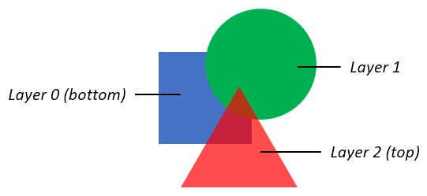
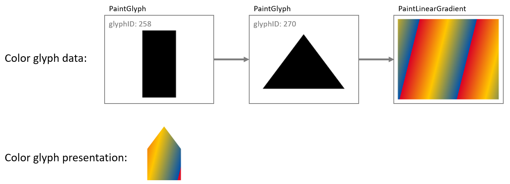
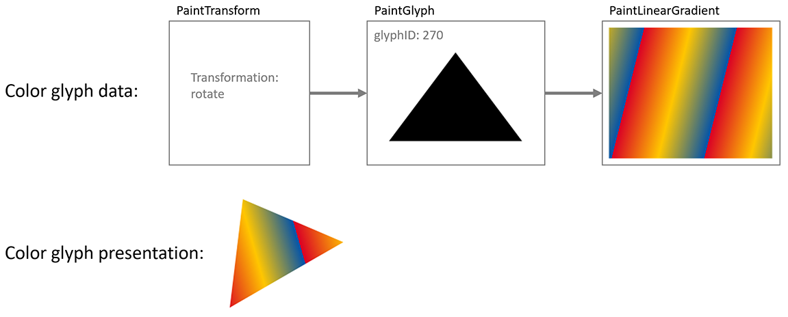
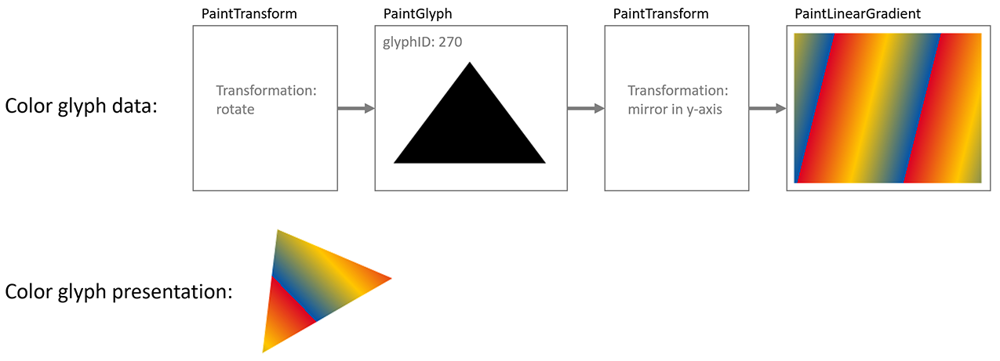
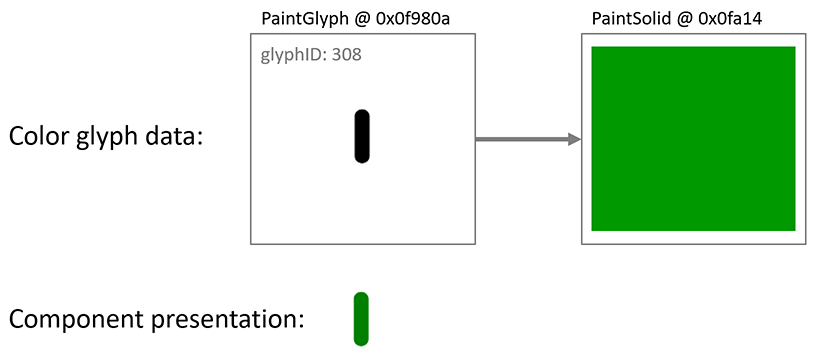
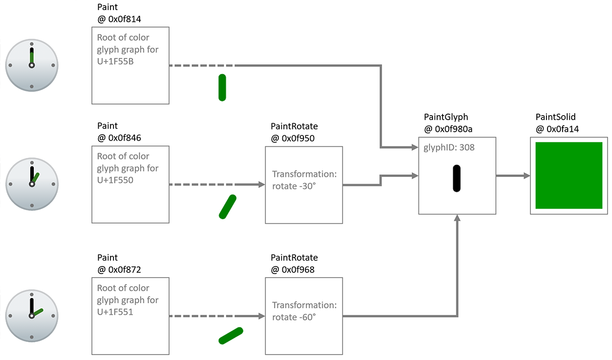

# Proposed changes to ISO/IEC 14496-22 (Amendment 2)

Changes to the following sections of ISO/IEC 14496-22:2019 Open Font Format
(OFF) are proposed:

- [4.3 Data types](#changes-to-off-43-data-types)
- [5.7.11 COLR – Color Table](#changes-to-off-5711---color-table)
- [7.2.3 Item variation stores](#changes-to-off-723-item-variation-stores)
- [Bibliography](#changes-to-off-bibliography)

## Changes to OFF 4.3 Data types

_Replace the table defining data types with the following (added row for Offset24):_

| Data Types | Description |
|-|-|
| uint8 | 8-bit unsigned integer. |
| int8 | 8-bit signed integer. |
| uint16 | 16-bit unsigned integer. |
| int16 | 16-bit signed integer. |
| uint24 | 24-bit unsigned integer. |
| uint32 | 32-bit unsigned integer. |
| int32 | 32-bit signed integer. |
| Fixed | 32-bit signed fixed-point number (16.16) |
| FWORD | int16 that describes a quantity in font design units. |
| UFWORD | uint16 that describes a quantity in font design units. |
| F2DOT14 | 16-bit signed fixed number with the low 14 bits of fraction (2.14). |
| LONGDATETIME | Date and time represented in number of seconds since 12:00 midnight, January 1, 1904. The value is represented as a signed 64-bit integer. |
| Tag | Array of four uint8s (length = 32 bits) used to identify a table, design-variation axis, script, language system, feature, or baseline |
| Offset16 | Short offset to a table, same as uint16, NULL offset = 0x0000 |
| Offset24 | 24-bit offset to a table, same as uint24, NULL offset = 0x000000 |
| Offset32 | Long offset to a table, same as uint32, NULL offset = 0x00000000 |

## Changes to OFF 5.7.11 - Color Table

_Replace the content of clause 5.7.11 with the following:_

The COLR table adds support for multi-colored glyphs in a manner that integrates
with the rasterizers of existing text engines and that is designed to be easy to
support with current OpenType font files.

The COLR table defines color presentations for glyphs. The color presentation of
a glyph is specified as a graphic composition using other glyphs, such as a
layered arrangement of glyphs, each with a different color. The term “color
glyph” is used informally to refer to such a graphic composition defined in the
COLR table; and the term “base glyph” is used to refer to a glyph for which a
color glyph is provided. Processing of the COLR table is done on glyph sequences
after text layout processing is completed and prior to final presentation of
glyphs. Typically, a base glyph is a glyph that may occur in a sequence that
results from the text layout process. In some cases, a base glyph may be a
virtual glyph defined within this table as a re-usable color composition.

For example, the Unicode character U+1F600 is the grinning face emoji. Suppose
in an emoji font the 'cmap' table maps U+1F600 to glyph ID 718. Assuming no
glyph substitutions, glyph ID 718 would be considered the base glyph. Suppose
the COLR table has data describing a color presentation for this using a layered
arrangement of other glyphs with different colors assigned: that description and
its presentation result would be considered the corresponding color glyph.

Two versions of the COLR table are defined.

Version 0 allows for a simple composition of colored elements: a linear sequence
of glyphs that are stacked vertically as layers in bottom-up z-order. Each layer
combines a glyph outline from the &#39;glyf&#39;, CFF or CFF2 table (referenced
by glyph ID) with a solid color fill. These capabilities are sufficient to
define color glyphs such as those illustrated in figure 5.6.


**Figure 5.6 Examples of the graphic capabilities of COLR version 0**

Version 1 supports additional graphic capabilities. In addition to solid colors,
gradient fills can be used, as well as more complex fills using other graphic
operations, including affine transformations and various blending modes. Version
1 capabilities allow for color glyphs such as those illustrated in figure 5.7:


**Figure 5.7 Examples of the graphic capabilities of COLR version 1**

Version 1 also extends capabilities in variable fonts. A COLR version 0 table
can be used in variable fonts with glyph outlines being variable, but no other
aspect of the color composition being variable. In version 1, all of the new
constructs for which it could be relevant have been designed to be variable; for
example, the placement of color stops in a gradient, or the alpha values applied
to colors. The graphic capabilities supported in version 0 and in version 1 are
described in more detail below.

The COLR table is used in combination with the CPAL table (5.7.12): all color
values are specified as entries in color palettes defined in the CPAL table. If
the COLR table is present in a font but no CPAL table exists, then the COLR
table is ignored.

**5.7.11.1 Graphic Compositions**

The graphic compositions in a color glyph definition use a set of 2D graphic
concepts and constructs:

* Shapes (or *geometries*)
* Fills (or *shadings*)
* Layering—a *z-order*—of elements
* Composition and blending modes—different ways that the content of a layer is
combined with the content of layers above or below it
* Affine transformations

For both version 0 and version 1, shapes are obtained from glyph outlines in the
&#39;glyf&#39;, &#39;CFF &#39; or CFF2 table, referenced by glyph ID. Colors
used in fills are obtained from the CPAL table.

The simplest color glyphs use just a few of the concepts above: shapes, solid
color fills, and layering. This is the set of capabilities provided by version 0
of the COLR table. In version 0, a base glyph record specifies the color glyph
for a given base glyph as a sequence of layers. Each layer is specified in a
layer record and has a shape (a glyph ID) and a solid color fill (a CPAL palette
entry). The filled shapes in the layer stack are composed using only alpha
blending.

Figure 5.8 illustrates the version 0 capabilities: three shapes are in a layered
stack: a blue square in the bottom layer, an opaque green circle in the next
layer, and a red triangle with some transparency in the top layer.



**Figure 5.8 Basic graphic capabilities of COLR version 0**

The basic concepts also apply to color glyphs defined using the version 1
formats: shapes are arranged in layers and have fills. But the additional
formats of version 1 support much richer capabilities. In a version 1 color
glyph, graphic constructs and capabilities are represented primarily in *Paint*
tables, which are linked together in a *directed, acyclic graph*. Several
different Paint formats are defined, each describing a particular type of
graphic operation:

* A PaintColrLayers table provides a layering structure used for creating a
color glyph from layered elements. A PaintColrLayers table can be used at the
root of the graph, providing a base layering structure for the entire color
glyph definition. A PaintColrLayers table can also be nested within the graph,
providing a set of layers to define some graphic sub-component within the color
glyph.

* The PaintSolid, PaintLinearGradient, and PaintRadialGradient tables provide
basic fills, using color entries from the CPAL table.

* The PaintGlyph table provides glyph outlines as the basic shapes.

* The PaintTransformed table is used to apply an affine transformation matrix to
a sub-graph of paint tables, and the graphic operations they represent. The
PaintTranslate, PaintRotate and PaintSkew tables support specific
transformations.

* The PaintComposite table supports alternate compositing and blending modes for
two sub-graphs.

* The PaintColrGlyph table allows a color glyph definition, referenced by a base
glyph ID, to be re-used as a sub-graph within multiple color glyphs.

In a simple color glyph description, a PaintGlyph table might be linked to a
PaintSolid table, for example, representing a glyph outline filled using a basic
solid color fill. But the PaintGlyph table could instead be linked to a much
more complex sub-graph of Paint tables, representing a shape that gets filled
using the more-complex set of operations described by the sub-graph of Paint
tables.

The graphic capabilities are described in more detail in 5.7.11.1.1 –
5.7.11.1.9. The formats used for each are specified 5.7.11.2.

**5.7.11.1.1 Colors and solid color fills**

All colors are specified as a base zero index into CPAL (5.7.12) palette
entries. A font can define alternate palettes in its CPAL table; it is up to the
application to determine which palette is used. A palette entry index value of
0xFFFF is a special case indicating that the text foreground color (defined by
the application) should be used, and shall not be treated as an actual index
into the CPAL ColorRecord array.

The CPAL color data includes alpha information, as well as RGB values. In the
COLR version 0 formats, a color reference is made in LayerRecord as a palette
entry index alone. In the formats added for COLR version 1, a color reference is
made in a ColorIndex record, which includes a palette entry index and a separate
alpha value. Separation of alpha from palette entries in version 1 allows use of
transparency in a color glyph definition independent of the choice of palette.
The alpha value in the ColorIndex record is multiplied into the alpha value
given in the CPAL color entry.

In version 1, a solid color fill is specified using a PaintSolid table. See
5.7.11.1.3 for details on how a PaintSolid fill is applied to a shape.

**5.7.11.1.2 Gradients**

COLR version 1 supports two types of gradients: linear gradients, and radial
gradients. Both types of gradient are defined using a color line.

**5.7.11.1.2.1 Color Lines**

A color line is a function that maps real numbers to color values to define a
one-dimensional gradation of colors, to be used in the definition of linear or
radial gradients. A color line is defined as a set of one or more color stops,
each of which maps a particular real number to a specific color.

On its own, a color line has no positioning, orientation or size within a design
grid. The definition of a linear or radial gradient will reference a color line
and map it onto the design grid by specifying positions in the design grid that
correspond to the real values 0 and 1 in the color line. The specification for
linear and radial gradients also include rules for where to draw interpolated
colors of the color line, following from the placement of 0 and 1.

A color stop is defined by a real number, the *stop offset*, and a color. A
color line is defined with at least one color stop within the interval [0, 1].
Additional color stops can be specified within or outside the interval [0, 1].
(Stop offsets are represented using F2DOT14 values, therefore color stops can
only be specified within the range [-2, 2). See 5.7.11.2.4 for format details.)
If only one color stop is specified, that color is used for the entire color
line; at least two color stops are needed to create color gradation.

Color gradation is defined over the interval from the first color stop, through
the successive color stops, to the last color stop. Between adjacent color
stops, color values are linearly interpolated.

> **_TBD: Does interpolation of colors need further specification?_**

If there are multiple color stops defined for the same stop offset, the first
one is used for computing color values on the color line below that stop offset,
and the last one is used for computing color values at or above that stop
offset. All other color stops for that stop offset are ignored.

While the color gradation is specified over a defined interval, the color line
continues indefinitely outside that interval in both directions. The color
pattern outside the defined interval is repeated according to the color line’s
*extend mode*. Three extend modes are supported:

* **Pad:** outside the defined interval, the color of the closest color stop is
used. Using a sequence of letters as an analogy, given a sequence “ABC”, it is
extended to “…*AA* ABC *CC*…”.

* **Repeat:** The color line is repeated over repeated multiples of the defined
interval. For example, if color stops are specified for defined interval of [0,
0.7], then the pattern is repeated above the defined interval for intervals
[0.7, 1.4], [1.4, 2.1], etc.; and also repeated below the defined interval for
intervals [-0.7, 0], [-1.4, -0.7], etc. In each repeated interval, the first
color is that of the farthest defined color stop. By analogy, given a sequence
“ABC”, it is extended to “…*ABC* ABC *ABC*…”.

* **Reflect:** The color line is repeated over repeated intervals, as for the repeat
mode. However, in each repeated interval, the ordering of color stops is the
reverse of the adjacent interval. By analogy, given a sequence “ABC”, it is
extended to “…*ABC CBA* ABC *CBA ABC*…”.

Figures 5.9 – 5.11 illustrate the different color line extend modes. The figures
show the color line extended over a limited interval, but the extension is
unbounded in either direction.


**Figure 5.9 Color gradation extended using pad mode**


**Figure 5.10 Color gradation extended using repeat mode**


**Figure 5.11 Color gradation extended using reflect mode**

NOTE: The extend modes are the same as the [spreadMethod][30] attribute used for
linear and radial gradients in the [Scalable Vector Graphics (SVG) 1.1 (Second
Edition)][31] specification.

When combining a color line with the geometry of a particular gradient
definition, one might want to achieve a certain number of repetitions of the
gradient pattern over a particular geometric range. Assuming that geometric
range will correspond to placement of stop offsets 0 and 1, the following steps
can be used:

* In order to get a certain number of repetitions of the gradient pattern
(without reflection), divide 1 by the number of desired repetitions, use the
result as the maximum stop offset for specified color stops, and set the extend
mode to *repeat*.
* In order to get a certain number of repetitions of the
reflected gradient pattern, divide 1 by two times the number of desired
repetitions, use the result as the maximum stop offset for specified color
stops, and set the extend mode to *reflect*.

**5.7.11.1.2.2 Linear gradients**

A linear gradient provide gradation of colors along a straight line. The
gradient is defined by two points, p₀ and p₁, plus a color line, with stop
offset 0 aligned to p₀ and stop offset 1.0 aligned to p₁. Colors between p₀ and
p₁ are interpolated using the color line.

An additional point, p₂, is also used to rotate the gradient orientation in the
space on either side of the line defined by p₀ and p₁. The vector from p₀ to p₂
can be referred to as the *rotation vector*. If the rotation vector is colinear
with the line p₀p₁, there is no rotation: colors in the space on either side of
the line p₀p₁ extend in the perpendicular direction. But if the rotation vector
is not colinear, the gradient is drawn skewed by the angle between p₀p₁ and
p₀p₂.

If the dot-product (p₁ - p₀) · (p₂ - p₀) is zero (or near-zero for an
implementation-defined definition) then the gradient is ill-formed and shall not
be rendered.

Figures 5.12 – 5.14 illustrate linear gradients using the three different color
line extend modes. Each figure illustrates linear gradients with two different
rotation vectors. In each case, three color stops are specified: red at 0.0,
yellow at 0.5, and red at 1.0.


**Figure 5.12 Linear gradients with different rotation vectors using the pad extend mode.**


**Figure 5.13 Linear gradients with different rotation vectors using the repeat extend mode.**


**Figure 5.14 Linear gradients with different rotation vectors using the reflect extend mode.**

**5.7.11.1.2.3 Radial gradients**

A radial gradient provides gradation of colors along a cylinder defined by two
circles. The gradient is defined by circles with center c₀ and radius r₀, and
with center c₁ and radius r₁, plus a color line. The color line aligns with the
two circles by associating stop offset 0 with the first circle (with center c₀)
and aligning stop offset 1.0 with the second circle (with center c₁). 

NOTE: The term “radial gradient” is used in some contexts for more limited
capabilities. In some contexts, the type of gradient defined here is referred to
as a “two point conical” gradient.

The drawing algorithm for radial gradients follows the [HTML WHATWG Canvas
specification for createRadialGradient()][32], but adapted with with alternate
color line extend modes, as described in 5.7.11.1.2.1. Radial gradients shall be
rendered with results that match the results produced by the following steps.

With circle center points c₀ and c₁ defined as c₀ = (x₀, y₀) and c₁ = (x₁, y₁):

1. If c₀ = c₁ and r₀ = r₁ then paint nothing and return.
2. For real values of ω:<br>
   Let x(ω) = (x₁-x₀)ω + x₀<br>
   Let y(ω) = (y₁-y₀)ω + y₀<br>
   Let r(ω) = (r₁-r₀)ω + r₀<br>
   Let the color at ω be the color at position ω on the color line.
3. For all values of ω where r(ω) > 0, starting with the value of ω nearest to
   positive infinity and ending with the value of ω nearest to negative
   infinity, draw the circumference of the ellipse resulting from translating
   a circle with radius r(ω) centered at position (x(ω), y(ω)), with
   the color at ω, but only painting on the parts of the bitmap that have not
   yet been painted on by earlier circles in this step for this rendering of the
   gradient.

The algorithm provides results in various cases as follows:

* When both radii are 0 (r₀ = r₁ = 0), then r(ω) is always 0 and nothing is
painted.
* If the centers of the circles are distinct, the radii of the circles are
different, and neither circle is entirely contained within the radius of the
other circle, then the resulting shape resembles a cone that is open to one
side. The surface outside the cone is not painted. (See figures 5.15 – 5.17.)
* If the centers of the circles are distinct but the radii are the same, and
neither circle is contained within the other, then the result will be a strip,
similar to the flattened projection of a circular cylinder. The surface outside
the strip is not painted. (See figures 5.18 – 5.20.)
* If the radii of the circles are different but one circle is entirely contained
within the radius of the other circle, the gradient will radiate in all
directions from the inner circle, and the entire surface will be painted. (See
figures 5.24 – 5.26.)

> **_TBD: What should the expected behaviour be in the case of both circles exactly overlapping with r > 0? (Only the extensions get painted, but how?)_**

Figures 5.15 – 5.17 illustrate radial gradients using the three different color
line extend modes. The color line is defined with stops for the interval [0, 1]:
red at 0.0, yellow at 0.5, and blue at 1.0. Note that the circles that define
the gradient are not stroked as part of the gradient itself. Stroked circles
have been overlaid in the figure to illustrate the color line and the region
that is painted in relation to the two circles.


**Figure 5.15 Radial gradient using pad extend mode.**


**Figure 5.16 Radial gradient using repeat extend mode.**


**Figure 5.17 Radial gradient using reflect extend mode.**

Figures 5.18 – 5.20 illustrate the case in which the circles have distinct centers but
the same radii, and neither circle is contained within the other, giving the
appearance of a strip. The color stops are as in the previous figures.


**Figure 5.18 Radial gradient with same-size circles appearing as a string, using pad extend mode.**


**Figure 5.19 Radial gradient with same-size circles appearing as a string, using repeat extend mode.**


**Figure 5.20 Radial gradient with same-size circles appearing as a string, using reflect extend mode.**

Because the rendering algorithm progresses ω in a particular direction, from
positive infinity to negative infinity, and because pixels are not re-painted as
ω progresses, the appearance will be affected by which circle is considered
circle 0 and which is circle 1. This is illustrated in figures 5.21 – 5.23. The
gradient in figure 5.21 is the same as that in figure 5.15, using the pad extend
mode. In this gradient, circle 0 is the small circle, on the left. In figure
5.22, the start and end circles are reversed: circle 0 is the large circle, on
the right. The color line is kept the same, and so the red end starts at circle
0, now on the right. In figure 5.23, the order of stops in the color line is
also reversed to put red on the left. The key difference to notice between the
gradients in these figures is the way that colors are painted in the interior:
when the two circles are not overlapping, the arcs of constant color bend in the
same direction as the near side of circle 1.

NOTE: This difference does not exist if one circle is entirely contained within
the other: in that case, the arcs of constant color are complete circles.


**Figure 5.21 Cone-shaped radial gradient with circle 0 on the left.**


**Figure 5.22 Cone-shaped radial gradient with start and end circles swapped.**


**Figure 5.23 Cone-shaped radial gradient with start and end circles swapped and color line reversed.**

When one circle is contained within the other, the extension of the gradient
beyond the larger circle will fill the entire surface. Colors in the areas
inside the inner circle and outside the outer circle are determined by the
extend mode. Figures 5.24 – 5.26 illustrate this for the different extend modes.


**Figure 5.24 Radial gradient with one circle contained within the other, pad extend mode.**


**Figure 5.25 Radial gradient with one circle contained within the other, repeat extend mode.**


**Figure 5.26 Radial gradient with one circle contained within the other, reflect extend mode.**

NOTE: A scale transformation (see 5.7.11.1.5) can flatten shapes to resemble
lines. If a radial gradient is nested in the child sub-graph of a transformation
that flattens the circles so that they are nearly lines, the centers may still
be separated by some distance. In that case, a radial gradient would appear as a
strip or a cone filled with a linear gradient.

> **_TBD: We still need to specify required behaviour for the case in which the transform really flattens the two circles, and the centers, to a line._**

**5.7.11.1.3 Filling shapes**

All basic shapes used in a color glyph are obtained from glyph outlines,
referenced using a glyph ID. In a color glyph description, a PaintGlyph table is
used to represent a basic shape. 

NOTE: Shapes can also be derived using PaintGlyph tables in combination with
other tables, such as PaintTransformed (see 5.7.11.1.5) or PaintComposite (see
5.7.11.1.6).

The PaintGlyph table has a field for the glyph ID, plus an offset to a child
paint table that is used as the fill for the shape. The glyph outline is not
rendered; only the fill is rendered.

Any of the basic fill formats, PaintSolid, PaintLinearGradient, or
PaintRadialGradient, can be used as the child paint table. This is illustrated
in figure 5.27: a PaintGlyph table has a glyph ID for an outline in the shape of
a triangle, and it links to a child PaintLinearGradient table. The combination
is used to represent a triangle filled with the linear gradient.


**Figure 5.27 PaintGlyph and PaintLinearGradient tables used to fill a shape with a linear gradient.**

Another way to describe the relationship between a PaintGlyph table and its
child paint table is that the child provides a fill, and the glyph outline
defines a bounds, or *clip region*, for the fill. The child for a PaintGlyph
table is not limited to only the basic fill formats. In general, the child can
be the root of a sub-graph that describes some graphic composition that
comprises the fill for the shape. Or, in the alternate view, the glyph outline
defines a clip region that is applied to the composition.

To illustrate this, the example in figure 5.27 is extended in figure 5.28 so
that a PaintGlyph table links to a second PaintGlyph that links to a
PaintLinearGradient: the parent PaintGlyph will clip the filled shape described
by the child sub-graph.



**Figure 5.28 A PaintGlyph table defines a clip region for the composition defined by its child sub-graph.**

A PaintGlyph table on its own does not add content: if there is no child paint
table, then the graph is not well formed. See 5.7.11.1.9 for details regarding
well-formedness and validity of the graph.

**5.7.11.1.4 Layering**

Layering of visual elements was introduced above, in the introduction to
5.7.11.1. Both version 0 and version 1 support use of multiple layers, though in
different ways.

For version 0, layers are fundamental: they are the sole way in which separate
elements are composed into a color glyph. An array of LayerRecords is created,
with each LayerRecord specifying a glyph ID and a CPAL entry (a shape and solid
color fill). Each color glyph definition is a slice from that array (that is, a
contiguous sub-sequence), specified in a BaseGlyphRecord for a particular base
glyph. Within a given slice, the first record specifies the content of the
bottom layer, and each subsequent record specifies content that overlays the
preceding content(increasing z-order). A single array is used for defining all
color glyphs. The LayerRecord slices for two base glyphs may overlap, though
often will not overlap.

Figure 5.29 illustrates layers using version 0 formats.


**Figure 5.29 Version 0: Color glyphs are defined by slices of a layer records array.**

When using version 1 formats, use of multiple layers is supported but is
optional. For example, a simple glyph description need not use any layering, as
illustrated in figure 5.30:


**Figure 5.30 Complete color glyph definition without use of layers.**

The version 1 formats define a color glyph as a directed, acyclic graph of paint
tables, and the concept of layering corresponds roughly to the number of
distinct leaf nodes in the graph. (See 5.7.11.1.9.) The basic fill
formats—PaintSolid, PaintLinearGradient and PaintRadialGradient—do not have
child paint tables and so can only be leaf nodes in the graph. Some paint
tables, such as the PaintGlyph table, have only a single child, so can be used
within a layer but do not provide any means of adding additional layers.
Increasing the number of layers requires paint tables that have two or more
children, creating a fork in the graph.

The version 1 formats include two paint formats that have two or more children,
and so can increase the number of layers in the graph:

* The PaintComposite table allows two sub-graphs to be composed together using
different compositing or blending modes.

* The PaintColrLayers table supports defining a sequence of several layers.

NOTE: The PaintColrGlyph table provides a means of incorporating the graph of
one color glyph as a sub-graph in the definition of another color glyph. In this
way, PaintColrGlyph provides an indirect means of introducing additional layers
into a color glyph definition: forks in the resulting graph do not come from the
PaintColrGlyph table itself, but can come from PaintColrLayers or PaintComposite
tables that are nested in the incorporated sub-graph. See 5.7.11.1.7.3 for a
description of the PaintColrGlyph table.

While the PaintComposite table only combines two sub-graphs, other
PaintComposite tables can be nested to provide additional layers. The primary
purpose of PaintComposite is to support compositing or blending modes other than
simple alpha blending. The PaintComposite table is covered in more detail in
5.7.11.1.6. The remainder of this clause will focus on the PaintColrLayers
table.

The PaintColrLayers table is used to define a bottom-up z-order sequence of
layers. Similar to version 0, it defines a layer set as a slice in an array, but
in this case the array is an array of offsets to paint tables, contained in a
LayerV1List table. Each referenced paint table is the root of a sub-graph of
paint tables that specifies a graphic composition to be used as a layer. Within
a given slice, the first offset provides the content for the bottom layer, and
each subsequent offset provides content that overlays the preceding content.
Definition of a layer set—a slice within the layer list—is given in a
PaintColorLayers table.

Figure 5.31 illustrates the organizational relationship between PaintColorLayers
tables, the LayerV1List, and referenced paint tables that are roots of
sub-graphs.


**Figure 5.31 Version 1: PaintColrLayers tables specify slices within the LayerV1List, providing a layering of content defined in sub-graphs.**

NOTE: Paint table offsets in the LayerV1List table are only used in conjuction
with PaintColrLayers tables. If a paint table does not need to be referenced via
a PaintColrLayers table, its offset does not need to be included in the
LayerV1List array.

A PaintColorLayers table can be used as the root of a color glyph definition,
providing a base layering structure for the color glyph. In this usage, the
PaintColrLayers table is referenced by a BaseGlyphV1Record, which specifies the
root of the graph of a color glyph definition for a given base glyph. This is
illustrated in figure 5.32.


**Figure 5.32 PaintColrLayers table used as the root of a color glyph definition.**

A PaintColorLayers table can also be nested more deeply within the graph,
providing a layer structure to define some component within a larger color glyph
definition. (See 5.7.11.1.7.2 for more information.) The ability to nest a
PaintColrLayers table within a graph creates the potential to introduce a cycle
within the graph, which would be invalid (see 5.7.11.1.9).

**5.7.11.1.5 Transformations**

A PaintTransform table can be used within a color glyph description to apply an
affine transformation matrix. Transformations supported by a matrix can be a
combination of scale, skew, mirror, rotate, or translate. The transformation is
applied to all nested paints in the child sub-graph.

The effect of a PaintTransform table is illustrated in figure 5.33: a
PaintTransform is used to specify a rotation, and both the glyph outline and
gradient in the sub-graph are rotated.



**Figure 5.33 A rotation transformation rotates the fill content defined by the child sub-graph.**

If another PaintTransform table occurs within the child sub-graph of the first
PaintTransform table, then the other PaintTransform also applies to its child
sub-graph. For the sub-sub-graph, the two transformations are combined. To
illustrate this, the example in figure 5.33 is extended in figure 5.34 by
inserting a mirroring transformation between the PaintGlyph and
PaintLinearGradient tables: the glyph outline is rotated as before, but the
gradient is mirrored in its (pre-rotation) y-axis as well as being rotated.
Notice that both visible elements—the shape and the gradient fill—are affected
by the rotation, but only the gradient is affected by the mirroring.



**Figure 5.34 Combined effects of a transformation nested within the child sub-graph of another transformation.**

The affine transformation is specified in a PaintTransform table as matrix
elements. See 5.7.11.2.5.7 for format details.

Whereas the PaintTransformed table supports several types of transforms, the
PaintTranslate, PaintRotate and PaintSkew tables support specific
transformations: translation, rotation and skew. The PaintTranslate table
provides a more compact representation for this common transform. The
significant difference of the PaintRotate and PaintSkew formats is that
rotations and skews are specified as angles, in counter-clockwise degrees.

NOTE: Specifying the rotation or skew as an angle can have a signficant benefit
in variable fonts if an angle of skew or rotation needs to vary, since it is
easier to implement variation of angles when specified directly rather than as
matrix elements. This is because the matrix elements for a rotation or skew are
the sine, cosine or tangent of the rotation angle, which do not change in linear
proportion to the angle. To achieve a linear variation of rotation using matrix
elements would require approximating the variation using multiple delta sets.

**5.7.11.1.6 Compositing and blending**

When a color glyph has overlapping content in two layers, the pixels in the two
layers must be combined in some way. If the content in the top layer has full
opacity, then normally the pixels from that layer are shown, occluding
overlapping pixels from lower layers. If the top layer has some transparency
(some portion has alpha less than 1.0), then blending of colors for overlapping
pixels occurs by default. The default interaction between layers uses simple
alpha compositing, as described in [Compositing and Blending Level 1][1].

A PaintComposite table can be used to get other compositing or blending effects.
The PaintComposite table combines content defined by two sub-graphs: a *source*
sub-graph; and a destination, or *backdrop*, sub-graph. First, the paint
operations for the backdrop sub-graph are executed, then the drawing operations
for the source sub-graph are executed and combined with backdrop using a
specified compositing or blending mode. The available modes are given in the
CompositionModes enumeration (see 5.7.11.2.5.11). The effect and processing rule
of each mode are specified in [Compositing and Blending Level 1][1].

The available modes fall into two general types: compositing modes, also
referred to as “Porter-Duff” modes; and blending modes. In rough terms, the
Porter-Duff modes determine how much effect pixels from the source and the
backdrop each contribute in the result, while blending modes determine how color
values for pixels from the source and backdrop are combined. These are
illustrated with examples in figures 5.35 and 5.36: in each case, red and blue
rectangles are the source and backdrop content.

Figure 5.35 shows the effect of a Porter-Duff mode, “XOR”, which has the effect
that only non-overlapping pixels contribute to the result.


**Figure 5.35 Two content elements combined using the Porter-Duff XOR mode.**

Figure 5.36 shows the effect of a “lighten” blending mode, which has the effect
that the R, G, and B color components for each pixel in the result is the
greater of the R, G, and B values from corresponding pixels in the source and
backdrop.


**Figure 5.36 Two content elements combined using the lighten blending mode.**

For complete details on each of the Porter-Duff and blending modes, see the
[Compositing and Blending Level 1][1] specification.

Figure 5.37 illustrates how the PaintComposite table is used in combination with
content sub-graphs to implement an alternate compositing effect. The source
sub-graph defines a green capital A; the backdrop sub-graph defines a black
circle. The compositing mode used is “source out”, which has the effect that the
source content punches out a hole in the backdrop. (For this mode, the fill
color of the source is irrelevant; a black or yellow "A" would have the same
effect.) A red rectangle is included as a lower layer to show that the backdrop
has been punched out by the source, making that portion of the lower layer
visible.


**Figure 5.37 A color glyph using a PaintComposite table to punch out a shape from the fill of a circle.**

NOTE: In figure 5.37, the “A” is filled with green to illustrate that the color
of the fill has no affect for the source out composite mode. Because that is the
case, the black or red PaintSolid could have been re-used instead of adding a
separate PaintSolid table. See 5.7.11.1.7.1 for more information on re-use of
paint tables for such situations.

[Scalable Vector Graphics (SVG)][31] supports alpha channel masking using the
&lt;mask&gt; element. The same effects can be implemented in COLR version 1
using a PaintComposite table by setting a pattern of alpha values in the source
sub-graph and selecting the source in composite mode. This is illustrated in
figure 5.38.


**Figure 5.38 An alpha mask implemented using a PaintComposite table and the source in mode.**

**5.7.11.1.7 Re-usable components**

Within a color font, many color glyphs might share components in common. For example, in emoji fonts, many different “smilies” or clock faces share a common background. This can be seen in figure 5.39, which shows color glyphs for three emoji clock faces.


**Figure 5.39 Emoji clock faces for 12 o’clock, 1 o’clock and 2 o’clock.**

Several components are shared between these color glyphs: the entire face, with
a gradient background and dots at the 3, 6, 9 and 12 positions; the minute hand
pointing to the 12 position; and the circles in the center. Also, note that the
four dots have the same shape and fill, and differ only in their position. In
addition, the hour hands have the same shape and fill, and differ only in their
orientation.

There are several ways in which elements of a color glyph description can be
re-used:

* Reference to shared subtables
* Use of a PaintColrLayers table
* Use of a PaintColrGlyph table

The PaintColrLayers and PaintColrGlyph table formats create a potential for
introducing cycles within the graph of a color glyph, which would be invalid
(see 5.7.11.1.9).

**5.7.11.1.7.1 Re-use by referencing shared subtables**

Several of the paint table formats link to a child paint table using a forward
offset within the file: PaintGlyph, PaintComposite, PaintTransformed,
PaintRotate, and PaintSkew. A child subtable can be shared by several tables of
these formats. For example, several PaintGlyph tables might link to the same
PaintSolid table, or to the same node for a sub-graph describing a more complex
fill. The only limitation is that child paint tables are referenced using a
forward offset from the start of the referencing table, so a re-used paint table
can only occur later in the file than any of the paint tables that use it.

The clock faces shown in figure 5.39 provide an example of how PaintRotate
tables can be combined with re-use of a sub-graph. As noted above, the hour
hands have the same shape and fill, but have a different orientation. The glyph
outline could point to the 12 position, then in color glyph descriptions for
other times, PaintRotate tables could link to the same glyph/fill sub-graph,
re-using that component but rotated as needed.

This is illustrated in the figures 5.40 and 5.41. Figure 5.40 shows a sub-graph
defining the hour hand, with upright orientation, using a PaintGlyph and a
PaintSolid table. Example file offsets for the tables are indicated.



**Figure 5.40 A PaintGlyph and PaintSolid table are used to define the clock hour hand pointing to 12.**

Figure 5.41 shows this sub-graph of paint tables being re-used, in some cases
linked from PaintRotate tables that rotate the hour hand to point to different
clock positions as needed. All of the paint tables that reference this sub-graph
occur earlier in the file.



**Figure 5.41 The sub-graphs for the hour hand are re-used with PaintRotate tables to point to different hours.**

**5.7.11.1.7.2 Re-use using PaintColrLayers**

As described above (see 5.7.11.1.4), a PaintColrLayers table defines a set of
paint sub-graphs arranged in bottom-up z-order layers, and an example was given
of a PaintColrLayers table used as the root of a color glyph definition. A
PaintColrLayers table can also be nested more deeply within the graph of a color
glyph. One purpose for doing this is to reference a re-usable component defined
as a contiguous set of layers in the LayersV1List table.

This is readily explained using the clock faces as an example. As described
above, each clock face shares several elements in common. Some of these form a
contiguous set of layers. Suppose four sub-graphs for shared clock face elements
are given in the LayerV1List as contiguous layers, as shown in figure 5.42. (For
brevity, the visual result for each sub-graph is shown, but not the paint
details.)


**Figure 5.42 Common clock face elements given as a slice within the LayerV1List table.**

A PaintColrLayers table can reference any contiguous slice of layers in the
LayerV1List table. Thus, the set of layers shown in figure 5.42 can be
referenced by PaintColrLayers tables anywhere in the graph of any color glyph.
In this way, this set of layers can be re-used in multiple clock face color
glyph definitions.

This is illustrated in figure 5.43: The color glyph definition for the one
o’clock emoji has a PaintColrLayers table as its root, referencing a slice of
three layers in the LayerV1List table. The upper two layers are the hour hand,
which is specific to this color glyph; and the cap over the pivot for the minute
and hour hands, which is common to other clock emoji but in a layer that is not
contiguous with other common layers. The bottom layer of these three layers is
the composition for all the remaining common layers. It is represented using a
nested PaintColrLayers table that references the slice within the LayerV1List
for the common clock face elements shown in figure 5.42.


**Figure 5.43 A PaintColrLayers table is used to reference a set of layers that define a shared clock face composition.**

The color glyphs for other clock face emoji could be structured in exactly the
same way, using a nested PaintColrLayers table to re-use the layer composition
of the common clock face elements.

**5.7.11.1.7.3 Re-use using PaintColrGlyph**

A third way to re-use components in color glyph definitions is to use a nested
PaintColrGlyph table. This format references a base glyph ID, which is used to
access a corresponding BaseGlyphV1Record. That record will provide the offset of
a paint table that is the root of a graph for a color glyph definition. That
graph can potentially be used as an independent color glyph, but it can also
define a shared composition that gets re-used in multiple color glyphs. Each
time the shared composition is to be re-used, it is referenced by its base glyph
ID using a PaintColrGlyph table. The graph of the referenced color glyph is
thereby incorporated into the graph of the PaintColrGlyph table as its child
sub-graph.

The glyph ID used may be that for a glyph outline, if there is an appropriate
glyph outline that corresponds to this composition. But the glyph ID may also be
greater than the last glyph ID used for outlines—that is, greater than or equal
to the numGlyphs value in the &#39;maxp&#39; table (5.2.6). Such virtual base
glyph IDs in the COLR table are only used within a PaintColrGlyph table, and are
not related to glyph IDs used in any other tables.

When a PaintColrGlyph table is used, a BaseGlyphV1Record with the specified
glyph ID is expected. If no BaseGlyphV1Record with that glyph ID is found, the
color glyph is not well formed. See 5.7.11.1.9 for details regarding
well-formedness and validity of the graph.

The example from 5.7.11.1.7.2 is modified to illustrate use of a PaintColrGlyph
table. In figure 5.44, a PaintColrLayers table references a slice within the
LayerV1List that defines the shared component. Now, however, this
PaintColrLayers table is treated as the root of a color glyph definition for
base glyph ID 63163. The color glyph for the one o’clock emoji is defined with
three layers, as before, but now the bottom layer uses a PaintColrGlyph table
that references the color glyph definition for glyph ID 63163.


**Figure 5.44 A PaintColrGlyph table is used to reference the shared clock face composition via a glyph ID.**

While the PaintColrGlyph and PaintColrLayers tables are similar in being able to
reference a layer set as a re-usable component, they could be handled
differently in implementations. In particular, an implementation could process
and cache the result of the color glyph description for a given base glyph ID.
In that case, subsequent references to that base glyph ID using a PaintColrGlyph
table would not require the corresponding graph of paint tables to be
re-processed. As a result, using a PaintColrGlyph for re-used graphic components
could provide performance benefits.

**5.7.11.1.8 Glyph metrics and boundedness**

**5.7.11.1.8.1 Metrics for color glyphs using version 0 formats**

For color glyphs using version 0 formats, the advance width of glyphs used for
each layer shall be the same as the advance width of the base glyph. If the font
has vertical metrics,  the glyphs used for each layer shall also have the same
advance height and vertical Y origin as the base glyph.

**5.7.11.1.8.2 Metrics and boundedness of color glyphs using version 1 formats**

For color glyphs using version 1 formats, the advance width of the base glyph
shall be used as the advance width for the color glyph. If the font has vertical
metrics, the advance height and vertical Y origin of the base glyph shall be
used for the color glyph. The advance width and height of glyphs referenced by
PaintGlyph tables are not required to be the same as that of the base glyph and
are ignored.

The bounding box of the base glyph is used as the bounding box of the color
glyph. A &#39;glyf&#39; entry with two points at diagonal extrema is sufficient
to define the bounding box.

NOTE: The bounding box of the base glyph can be used to allocate a drawing
surface without needing to traverse the graph of the color glyph definition.

A valid color glyph definition shall define a bounded region—that is, it shall
paint within a region for which a finite bounding box could be defined. The
different paint formats have different boundedness characteristics:

* PaintGlyph is inherently bounded.
* PaintSolid, PaintLinearGradient and PaintRadialGradient are inherently unbounded.
* PaintColrLayers is bounded *if and only if* all referenced sub-graphs are
bounded.
* PaintColrGlyph is bounded *if and only if* the color glyph definition for the
referenced base glyph ID is bounded.
* PaintTransformed, PaintTranslate, PaintRotate and PaintSkew are bounded *if
and only if* the referenced sub-graph is bounded.
* PaintComposite is either bounded or unbounded, according to the composite mode
used and the boundedness of the referenced sub-graphs. See 5.7.11.2.5.11 for
details.

Applications shall confirm that a color glyph definition is bounded, and shall
not render a color glyph if the defining graph is not bounded.

**5.7.11.1.9 Color glyphs as a directed acyclic graph**

When using version 1 formats, a color glyph is defined by a directed, acyclic
graph of linked paint tables. For each BaseGlyphV1Record, the paint table
referenced by that record is the root of a graph defining a color glyph
composition.

The graph for a given color glyph is made up of all paint tables reachable from
the BaseGlyphV1Record. The BaseGlyphV1Record and several paint table formats use
direct links; that is, they include a forward offset to a paint subtable. Two
paint formats make indirect links:

* A PaintColrLayers table references a slice of offsets within the LayerV1List.
The paint tables referenced by those offsets are considered to be linked within
the graph as children of the PaintColrLayers table.

* A PaintColrGlyph table references a base glyph ID, for which a corresponding
BaseGlyphV1Record is expected. That record points to the root of a graph that is
a complete color glyph definition on its own. But when referenced in this way by
a PaintColrGlyph table, that entire graph is considered to be a child sub-graph
of the PaintColrGlyph table, and a continuation of the graph of which the
PaintColrGlyph table is a part.

The graph for a color glyph is a combination of paint table using any of the
paint table formats. The simplest color glyph definition would consist of a
PaintGlyph table linked to a basic fill table (PaintSolid, PaintLinearGradient
or PaintRadialGradient). But the graph can be arbitrarily complex, with an
arbitrary depth of paint nodes (to the limits inherent in the formats).

The graph can define a visual element in a single layer, or many elements in
many layers. The concept of layers, as distinct visual elements stacked in a
z-order, is not precisely defined in relation to the complexity of the graph.
Each separate visual element requires a leaf node, but nodes in the graph,
including leaf nodes, can be re-used (see 5.7.11.1.7). Also, each separate
visual element requires a fork in the graph, and a separate root-to-leaf path,
but not all paths necessarily result in a distinct visual element. For example,
a gradient mask effect can be created with a gradient with gradation of alpha
values, and then using that as the source of a PaintComposite with the *source
in* compositing mode. In that case, the leaf has a visual affect but does not
result in a distinct visual element. This was illustrated in figure 5.38,
repeated here as figure 5.45: the PaintLinearGradient is a leaf node in the
graph and creates a masking effect but does not add a distinct visual element.


**Figure 5.45 Graph with a leaf node that isn't a distinct visual element.**

Thus, the generalization that can be made regarding the relationship between the
number of layers and the nature of the graph is that the number of distinct
root-to-leaf paths will be greater than or equal to the number of layers.

The following are necessary for the graph to be well-formed and valid:

* All subtable links shall satisfy the following criteria:
  * Forward offsets are within the COLR table bounds.
  * If a PaintColrLayers table is present, then a LayersV1List is also present,
and the referenced slice is within the length of the LayersV1List.
  * If a PaintColrGlyph table is present, there is a BaseGlyphV1Record for the
referenced base glyph ID.
* The graph shall be acyclic.

NOTE: These constraints imply that all leaf nodes will be one of PaintSolid,
PaintLinearGradient or PaintRadialGradient.

For the graph to be acyclic, no paint table shall have any child or descendent
paint table that is also its parent or ancestor within the graph. In particular,
because the PaintColrLayers and PaintColrGlyph tables use indirect child
references rather than forward offsets, they provide a possibility for
introducing cycles. Applications should track paint tables within a path in the
graph, checking whether any paint table was already encountered within that
path. The following pseudo-code algorithm can be used:

```
    // called initially with the root paint and an empty set pathPaints
    function paintIsAcyclic(paint, pathPaints)
        if paint is in pathPaints
          return false // cycle detected
        add paint to pathPaints
        for each childPaint referenced by paint as a child subtable
          call paintIsAcyclic(childPaint, pathPaints)
        remove paint from pathPaints
```

For the graph to be valid, it shall also be visually bounded, as described in
5.7.11.1.8.2.

NOTE: Implementations can combine testing for cycles and other well-formedness
or validity requirements together with other processing for rendering the color
glyph.

If the graph contains a cycle or is otherwise not well formed or valid, the
paint table at which the error occurs should be ignored, that sub-graph should
not be rendered, and that node in the graph should be considered to be visually
bounded. The application should attempt to render the remainder of the graph, if
well formed and valid.

Future minor version updates of the COLR table could introduce new paint
formats. If a paint table with an unrecognized format is encountered, it and its
sub-graph should similarly be ignored, the node should be considered to be
visually bounded, and the application should attempt to render the remainder of
the graph.

If an application is not able to recover from errors while traversing the graph,
it may ignore the color glyph entirely. If the base glyph ID has an outline,
that may be rendered as a non-color glyph instead.

**5.7.11.2 COLR table formats**

Various table and record formats are defined for COLR version 0 and version 1.
Several values contained within the version 1 formats are variable. These use
various record formats that combine a basic data type with a variation delta-set
index: VarFWord, VarUFWord, VarF2Dot14, and VarFixed. These are described in
7.2.3.1.

All table offsets are from the start of the parent table in which the offset is
given, unless otherwise indicated.

**5.7.11.2.1 COLR header**

The COLR table begins with a header. Two versions have been defined. Offsets in
the header are from the start of the table.

**5.7.11.2.1.1 COLR version 0**

*COLR version 0:*

| Type | Field name | Description |
|-|-|-|
| uint16 | version | Table version number—set to 0. |
| uint16 | numBaseGlyphRecords | Number of BaseGlyph records. |
| Offset32 | baseGlyphRecordsOffset | Offset to baseGlyphRecords array. |
| Offset32 | layerRecordsOffset | Offset to layerRecords array. |
| uint16 | numLayerRecords | Number of Layer records. |

NOTE: For fonts that use COLR version 0, some early Windows implementations of
the COLR table require glyph ID 1 to be the .null glyph.

**5.7.11.2.1.2 COLR version 1**

*COLR version 1:*

| Type | Field name | Description |
|-|-|-|
| uint16 | version | Table version number—set to 1. |
| uint16 | numBaseGlyphRecords | Number of BaseGlyph records; may be 0 in a version 1 table. |
| Offset32 | baseGlyphRecordsOffset | Offset to baseGlyphRecords array (may be NULL). |
| Offset32 | layerRecordsOffset | Offset to layerRecords array (may be NULL). |
| uint16 | numLayerRecords | Number of Layer records; may be 0 in a version 1 table. |
| Offset32 | baseGlyphV1ListOffset | Offset to BaseGlyphV1List table. |
| Offset32 | layersV1Offset | Offset to LayerV1List table (may be NULL). |
| Offset32 | itemVariationStoreOffset | Offset to ItemVariationStore (may be NULL). |

The BaseGlyphV1List and its subtables are only used in COLR version 1.

The LayersV1List is only used in conjunction with the BaseGlyphV1List and,
specifically, with PaintColrLayers tables (5.7.11.2.5.1); it is not required if
no color glyphs use a PaintColrLayers table. If not used, set layersV1Offset to
NULL.

The ItemVariationStore is used in conjunction with a BaseGlyphV1List and its
subtables, but only in variable fonts. If it is not used, set
itemVariationStoreOffset to NULL.

**5.7.11.2.1.3 Mixing version 0 and version 1 formats**

A font that uses COLR version 1 and that includes a BaseGlyphV1List can also
include BaseGlyph and Layer records for compatibility with applications that
only support COLR version 0.

Color glyphs that can be implemented in COLR version 0 using BaseGlyph and Layer
records can also be implemented using the version 1 BaseGlyphV1List and
subtables. Thus, a font that uses the version 1 formats does not need to use the
version 0 BaseGlyph and Layer records. However, a font may use the version 1
structures for some base glyphs and the version 0 structures for other base
glyphs. A font may also include a version 1 color glyph definition for a given
base glyph ID that is equivalent to a version 0 definition, though this should
never be needed. 

A font may define a color glyph for a given base glyph ID using version 0
formats, and also define a different color glyph for the same base glyph ID
using version 1 formats. Applications that support COLR version 1 should give
preference to the version 1 color glyph.

For applications that support COLR version 1, the application should search for
a base glyph ID first in the BaseGlyphV1List. Then, if not found, search in the
baseGlyphRecords array, if present.

**5.7.11.2.2 BaseGlyph and Layer records**

BaseGlyph and Layer records are required for COLR version 0, but optional for
version 1. (See 5.7.11.2.1.3.)

A BaseGlyph record is used to map a base glyph to a sequence of layer records
that define the corresponding color glyph. The BaseGlyph record includes a base
glyph index, an index into the layerRecords array, and the number of layers.

*BaseGlyph record:*

| Type | Field name | Description |
|-|-|-|
| uint16 | glyphID | Glyph ID of the base glyph. |
| uint16 | firstLayerIndex | Index (base 0) into the layerRecords array. |
| uint16 | numLayers | Number of color layers associated with this glyph. |

The glyph ID shall be less than the numGlyphs value in the &#39;maxp&#39; table
(5.2.6).

The BaseGlyph records shall be sorted in increasing glyphID order. It is assumed
that a binary search can be used to find a matching BaseGlyph record for a
specific glyphID.

The color glyph for a given base glyph is defined by the consecutive records in
the layerRecords array for the specified number of layers, starting with the
record indicated by firstLayerIndex. The first record in this sequence is the
bottom layer in the z-order, and each subsequent layer is stacked on top of the
previous layer.

The layer record sequences for two different base glyphs may overlap, with some
layer records used in multiple color glyph definitions.

The Layer record specifies the glyph used as the graphic element for a layer and
the solid color fill.

*Layer record:*

| Type | Field name | Description |
|-|-|-|
| uint16 | glyphID | Glyph ID of the glyph used for a given layer. |
| uint16 | paletteIndex | Index (base 0) for a palette entry in the CPAL table. |

The glyphID in a Layer record shall be less than the numGlyphs value in the
&#39;maxp&#39; table. That is, it shall be a valid glyph with outline data in
the &#39;glyf&#39; (5.3.4), &#39;CFF &#39; (5.4.2) or CFF2 (5.4.3) table. See
5.7.11.1.8.2 for requirements regarding glyph metrics of referenced glyphs.

The paletteIndex value shall be less than the numPaletteEntries value in the
CPAL table (5.7.12). A paletteIndex value of 0xFFFF is a special case,
indicating that the text foreground color (as determined by the application) is
to be used.

**5.7.11.2.3 BaseGlyphV1List and LayerV1List**

The BaseGlyphV1List table is, conceptually, similar to the baseGlyphRecords
array in COLR version 0, providing records that map a base glyph to a color
glyph definition. The color glyph definition is significantly different,
however—see 5.7.11.1.

*BaseGlyphV1List table:*

| Type | Name | Description |
|-|-|-|
| uint32 | numBaseGlyphV1Records |  |
| BaseGlyphV1Record | baseGlyphV1Records[numBaseGlyphV1Records] | |

*BaseGlyphV1Record:*

| Type | Name | Description |
|-|-|-|
| uint16 | glyphID | Glyph ID of the base glyph. |
| Offset32 | paintOffset | Offset to a Paint table. |

The glyph ID is not limited to the numGlyphs value in the &#39;maxp&#39; table
(5.2.6). See 5.7.11.1.7.3 for more information.

The records in the baseGlyphV1Records array shall be sorted in increasing
glyphID order. It is intended that a binary search can be used to find a
matching BaseGlyphV1Record for a specific glyphID.

The paint table referenced by the BaseGlyphV1Record is the root of the graph for
a color glyph definition.

NOTE: Often the paint table that is the root of the graph for the color glyph
definition will be a PaintColrLayers table, though this is not required. See
5.7.11.1.9 more information regarding the graph of a color glyph, and 5.7.11.1.4
for background information regarding the PaintColrLayers table.

A LayerV1List table is used in conjuction with PaintColrLayers tables to
represent layer structures. A single LayerV1List is defined and can be used by
multiple PaintColrLayer tables, each of which references a slice of the layer
list.

*LayerV1List table:*

| Type | Field name | Description |
|-|-|-|
| uint32 | numLayers |  |
| Offset32 | paintOffsets[numLayers] | Offsets to Paint tables. |

The sequence of offsets to paint tables corresponds to a bottom-up z-order
layering of the graphic compositions defined by the sub-graph of each referenced
paint table graph. For a given slice of the list, the sub-graph of the first
paint table defines the element at the bottom of the z-order, and the sub-graph
of each subsequent paint table defines an element that is layered on top of the
previous element. As each element is a composition defined in a sub-graph, one
of these elements may itself be multi-layered. In that case, the layers of this
element are stack above all previous layers, and layers of following elements
are stacked above the top layer of this element.

Offsets for paint tables not referenced by any PaintColrLayers table should not
be included in the paintOffsets array.

**5.7.11.2.4 ColorIndex, ColorStop and ColorLine**

Colors are used in solid color fills for graphic elements, or as *stops* in a
color line used to define a gradient. Colors are defined by reference to palette
entries in the CPAL table (5.7.12). While CPAL entries include an alpha
component, a ColorIndex record is defined here that includes a separate alpha
specification that supports variation in a variable font.

*ColorIndex record:*

| Type | Name | Description |
|-|-|-|
| uint16 | paletteIndex | Index for a CPAL palette entry. |
| VarF2Dot14 | alpha | Variable alpha value. |

A paletteIndex value of 0xFFFF is a special case, indicating that the text
foreground color (as determined by the application) is to be used.

The alpha.value is always set explicitly. Values for alpha outside the range
[0., 1.] (inclusive) are reserved; values outside this range shall be clipped. A
value of zero means no opacity (fully transparent); 1.0 means fully opaque (no
transparency). The alpha indicated in this record is multiplied with the alpha
component of the CPAL entry (converted to float—divide by 255). Note that the
resulting alpha value can be combined with and does not supersede alpha or
opacity attributes set in higher-level, application-defined contexts.

See 5.7.11.1.1 for more information regarding color references and solid color
fills.

Gradients are defined using a color line. A color line is a mapping of real
numbers to color values, defined using color stops. See 5.7.11.1.2.1 for an
overview and additional details.

*ColorStop record:*

| Type | Name | Description |
|-|-|-|
| VarF2Dot14 | stopOffset | Position on a color line; variable. |
| ColorIndex | color | |

A color line is defined by an array of ColorStop records plus an extend mode.

*ColorLine table:*

| Type | Name | Description |
|-|-|-|
| uint8 | extend | An Extend enum value. |
| uint16 | numStops | Number of ColorStop records. |
| ColorStop | colorStops[numStops] | |

Applications shall apply the colorStops in increasing stopOffset order. The
stopOffset value uses a variable structure and, with a variable font, the
relative orderings of ColorStop records along the color line can change as a
result of variation. With a variable font, the colorStops shall be ordered after
the instance values for the stop offsets have been derived.

A color line defines stops for only certain positions along the line, but the
color line extends infinitely in either direction. The extend field is used to
indicate how the color line is extended. The same behavior is used for extension
in both directions. The extend field uses the following enumeration:

*Extend enumeration:*

| Value | Name | Description |
|-|-|-|
| 0 | EXTEND_PAD     | Use nearest color stop. |
| 1 | EXTEND_REPEAT  | Repeat from farthest color stop. |
| 2 | EXTEND_REFLECT | Mirror color line from nearest end. |

The extend mode behaviors are described in detail in 5.7.11.1.2.1. If a
ColorLine in a font has an unrecognized extend value, applications should use
EXTEND_PAD by default.

**5.7.11.2.5 Paint tables**

Paint tables are used for COLR version 1 color glyph definitions. Eleven Paint
table formats are defined (formats 1 to 11), each providing a different graphic
capability for defining the composition for a color glyph. The graphic
capability of each format and the manner in which they are combined to represent
a color glyph has been described above—see 5.7.11.1.

Each paint table format has a format field as the first field. When parsing font
data, the format field can be read first to determine the format of the table.

**5.7.11.2.5.1 Format 1: PaintColrLayers**

Format 1 is used to define a vector of layers. The layers are a slice of layers
from the LayerV1List table. The first layer is the bottom of the z-order, and
subsequent layers are composited on top using the COMPOSITE_SRC_OVER composition
mode (see 5.7.11.2.5.10).

For general information on the PaintColrLayers table, see 5.7.11.1.4. For
information about its use for shared, re-usable components, see 5.7.11.1.7.2.

*PaintColrLayers table (format 1):*

| Type | Field name | Description |
|-|-|-|
| uint8 | format | Set to 1. |
| uint8 | numLayers | Number of offsets to paint tables to read from
LayerV1List. |
| uint32 | firstLayerIndex | Index (base 0) into the LayerV1List. |

NOTE: An 8-bit value is used for numLayers to minimize size for common
scenarios. If more than 256 layers are needed, then two or more PaintColrLayers
tables can be combined in a tree using a PaintComposite table or another
PaintColrLayers table to combine them.

**5.7.11.2.5.2 Format 2: PaintSolid**

Format 2 is used to specify a solid color fill. For general information about
specifying color values, see 5.7.11.1.1. For information about applying a fill
to a shape, see 5.7.11.1.3.

*PaintSolid table (format 2):*

| Type | Field name | Description |
|-|-|-|
| uint8 | format | Set to 2. |
| ColorIndex | color | ColorIndex record for the solid color fill. |

The ColorIndex record format is specified in 5.7.11.2.4.

**5.7.11.2.5.3 Format 3: PaintLinearGradient**

Format 3 is used to specify a linear gradient fill. For general information
about linear gradients, see 5.7.11.1.2.2. 

The PaintLinearGradient table has a ColorLine subtable. The ColorLine table
format is specified in 5.7.11.2.4. For background information on the color line,
see 5.7.11.1.2.1.

For information about applying a fill to a shape, see 5.7.11.1.3.

*PaintLinearGradient table (format 3):*

| Type | Field name | Description |
|-|-|-|
| uint8 | format | Set to 3. |
| Offset24 | colorLineOffset | Offset to ColorLine table. |
| VarFWord | x0 | Start point x coordinate. |
| VarFWord | y0 | Start point y coordinate. |
| VarFWord | x1 | End point x coordinate. |
| VarFWord | y1 | End point y coordinate. |
| VarFWord | x2 | Rotation vector end point x coordinate. |
| VarFWord | y2 | Rotation vector end point y coordinate. |

**5.7.11.2.5.4 Format 4: PaintRadialGradient**

Format 4 is used to specify a radial gradient fill. For general information
about radial gradients supported in COLR version 1, see 5.7.11.1.2.3. 

The PaintRadialGradient table has a ColorLine subtable. The ColorLine table
format is specified in 5.7.11.2.4. For background information on the color line,
see 5.7.11.1.2.1.

For information about applying a fill to a shape, see 5.7.11.1.3.

*PaintRadialGradient table (format 4):*

| Type | Field name | Description |
|-|-|-|
| uint8 | format | Set to 4. |
| Offset24 | colorLineOffset | Offset to ColorLine table. |
| VarFWord | x0 | Start circle center x coordinate. |
| VarFWord | y0 | Start circle center y coordinate. |
| VarUFWord | radius0 | Start circle radius. |
| VarFWord | x1 | End circle center x coordinate. |
| VarFWord | y1 | End circle center y coordinate. |
| VarUFWord | radius1 | End circle radius. |

**5.7.11.2.5.5 Format 5: PaintGlyph**

Format 5 is used to specify a glyph outline to use as a shape to be filled or,
equivalently, a clip region. The outline sets a clip region that constrains the
content of a separate paint subtable and the sub-graph linked from that
subtable.

For information about applying a fill to a shape, see 5.7.11.1.3.

*PaintGlyph table (format 5):*

| Type | Field name | Description |
|-|-|-|
| uint8 | format | Set to 5. |
| Offset24 | paintOffset | Offset to a Paint table. |
| uint16 | glyphID | Glyph ID for the source outline. |

The glyphID value shall be less than the numGlyphs value in the &#39;maxp&#39;
table (5.2.6). That is, it shall be a valid glyph with outline data in the
&#39;glyf&#39; (5.3.4), &#39;CFF &#39; (5.4.2) or CFF2 (5.4.3) table.

**5.7.11.2.5.6 Format 6: PaintColrGlyph**

Format 6 is used to allow a color glyph definition from the BaseGlyphV1List to
be a re-usable component that can be incorporated into multiple color glyph
definitions. See 5.7.11.1.7.3 for more information.

*PaintColrGlyph table (format 6):*

| Type | Field name | Description |
|-|-|-|
| uint8 | format | Set to 6. |
| uint16 | glyphID | Virtual glyph ID for a BaseGlyphV1List base glyph. |

The glyphID value shall be a glyphID found in a BaseGlyphV1Record within the
BaseGlyphV1List. It may be a *virtual* glyph ID, greater than or equal to the
numGlyph value in the &#39;maxp&#39; table (5.2.6). The BaseGlyphV1Record
provides an offset to a paint table; that paint table and the graph linked from
it are incorporated as a child sub-graph of the PaintColrGlyph table within the
current color glyph definition.

**5.7.11.2.5.7 Format 7: PaintTransformed**

Format 7 is used to apply an affine transformation to a sub-graph. The paint
table that is the root of the sub-graph is linked as a child. See 5.7.11.1.5 for
general information regarding transformations in a color glyph definition.

*PaintTransformed table (format 7):*

| Type | Field name | Description |
|-|-|-|
| uint8 | format | Set to 7. |
| Offset24 | paintOffset | Offset to a Paint subtable. |
| Affine2x3 | transform | An Affine2x3 record (inline). |

The affine transformation is defined by a 2×3 matrix, specified in an Affine2x3
record. The 2×3 matrix supports scale, skew, reflection, rotation, and
translation transformations. The matrix elements use VarFixed records, allowing
the transform definition to be variable in a variable font.

*Affine2x3 record:*

| Type | Name | Description |
|-|-|-|
| VarFixed | xx | x-component of transformed x-basis vector |
| VarFixed | yx | y-component of transformed x-basis vector |
| VarFixed | xy | x-component of transformed y-basis vector |
| VarFixed | yy | y-component of transformed y-basis vector |
| VarFixed | dx | Translation in x direction. |
| VarFixed | dy | Translation in y direction. |

For a pre-transformation position *(x, y)*,  The post-transformation position *(x&#x2032;, y&#x2032;)* is calculated as follows:

*x&#x2032;* = *xx \* x + xy \* y + dx*  
*y&#x2032;* = *yx \* x + yy \* y + dy*

NOTE: It is helpful to understand linear transformations by their effect
on *x-* and *y-basis* vectors _î = (1, 0)_ and _ĵ = (0, 1)_. The transform
described by the Affine2x3 record maps the basis vectors to _î&#x2032; = (xx,
yx)_ 
and _ĵ&#x2032; = (xy, yy)_, and translates the origin to _(dx, dy)_.

When the transformed composition from the referenced paint table (and its
sub-graph) is composed into the destination (represented by the parent of this
table), the source design grid origin is aligned to the destination design grid
origin. The transform can translate the source such that a pre-transform
position (0,0) is moved elsewhere. The *post-transform* origin, (0,0), is
aligned to the destination origin.

**5.7.11.2.5.8 Format 8: PaintTranslate**

Format 8 is used to apply a translation to a sub-graph. The paint table that is
the root of the sub-graph is linked as a child.

See 5.7.11.1.5 for general information regarding transformations in a color
glyph definition.

*PaintTranslate table (format 8):*

| Type | Field name | Description |
|-|-|-|
| uint8 | format | Set to 8. |
| Offset24 | paintOffset | Offset to a Paint subtable. |
| VarFixed | dx | Translation in x direction. |
| VarFixed | dy | Translation in y direction. |

NOTE: Pure translation can also be represented using the PaintTransformed table
by setting _xx_ = 1, _yy_ = 1, _xy_ and _yx_ = 0, and setting _dx_ and _dy_ to
the translation values. The PaintTranslate table provides a more compact
representation when only translation is required.

The translation will result in the pre-transform position (0,0) being moved
elsewhere. See 5.7.11.2.5.7 regarding alignment of the transformed content with
the destination.

**5.7.11.2.5.9 Format 9: PaintRotate**

Format 9 is used to apply a rotation to a sub-graph. The paint table that is the
root of the sub-graph is linked as a child. The amount of rotation is expressed
directly as an angle, and X and Y coordinates can be provided for the center of
rotation.

See 5.7.11.1.5 for general information regarding transformations in a color
glyph definition.

*PaintRotate table (format 9):*

| Type | Field name | Description |
|-|-|-|
| uint8 | format | Set to 9. |
| Offset24 | paintOffset | Offset to a Paint subtable. |
| VarFixed | angle | Rotation angle, in counter-clockwise degrees. |
| VarFixed | centerX | x coordinate for the center of rotation. |
| VarFixed | centerY | y coordinate for the center of rotation. |

NOTE: Pure rotation can also be represented using the PaintTransformed table.
For rotation about the origin, this could be done by setting matrix values as
follows for angle &theta;: 

* _xx_ = cos(&theta;)
* _yx_ = sin(&theta;)
* _xy_ = -sin(&theta;)
* _yy_ = cos(&theta;)
* _dx_ = _dy_ = 0

The important difference of the PaintRotate table is in allowing an angle to be
specified directly in degrees, rather than as changes to basis vectors. In
variable fonts, if a rotation angle needs to vary, it is easier to get smooth
variation if an angle is specified directly than when using trigonometric
functions to derive matrix elements.

A rotation can result in the pre-transform position (0, 0) being moved
elsewhere. See 5.7.11.2.5.7 regarding alignment of the transformed content with
the destination.

**5.7.11.2.5.10 Format 10: PaintSkew**

Format 10 is used to apply a skew to a sub-graph. The paint table that is the
root of the sub-graph is linked as a child. The amount of skew in the X or Y
direction is expressed directly as angles, and X and Y coordinates can be
provided for the center of rotation.

See 5.7.11.1.5 for general information regarding transformations in a color
glyph definition.

*PaintSkew table (format 10):*

| Type | Field name | Description |
|-|-|-|
| uint8 | format | Set to 10. |
| Offset24 | paintOffset | Offset to a Paint subtable. |
| VarFixed | xSkewAngle | Angle of skew in the direction of the x-axis, in counter-clockwise degrees. |
| VarFixed | ySkewAngle | Angle of skew in the direction of the y-axis, in counter-clockwise degrees. |
| VarFixed | centerX | x coordinate for the center of rotation. |
| VarFixed | centerY | y coordinate for the center of rotation. |

NOTE: Pure skews can also be represented using the PaintTransformed table. For
skews about the origin, this could be done by setting matrix values as follows
for _x_ skew angle &phi; and _y_ skew angle &psi;:

* _xx_ = _yy_ = 1
* _yx_ = tan(&psi;)
* _xy_ = -tan(&phi;)
* _dx_ = _dy_ = 0

The important difference of the PaintSkew table is in being able to specify skew
as an angle, rather than as changes to basis vectors. In variable fonts, if a
skew angle needs to vary, it is easier to get smooth variation if an angle is
specified directly than when using trigonometric functions to derive matrix
elements.

A skew can result in the pre-transform position (0, 0) being moved elsewhere.
See 5.7.11.2.5.7 regarding alignment of the transformed content with the
destination.

**5.7.11.2.5.11 Format 11: PaintComposite**

Format 11 is used to combine two layered compositions, referred to as *source*
and *backdrop*, using different compositing or blending modes. The available
compositing and blending modes are defined in an enumeration. See 5.7.11.1.6 for
general information and examples.

NOTE: The backdrop is also referred to as the “destination”.

*PaintComposite table (format 11):*

| Type | Field name | Description |
|-|-|-|
| uint8 | format | Set to 11. |
| Offset24 | sourcePaintOffset | Offset to a source Paint table. |
| uint8 | compositeMode | A CompositeMode enumeration value. |
| Offset24 | backdropPaintOffset | Offset to a backdrop Paint table, from start of PaintComposite table. |

The compositionMode value must be one of the values defined in the CompositeMode enumeration. If an unrecognized value is encountered, COMPOSITE_CLEAR shall be used.

*CompositeMode enumeration:*

| Value | Name | Description |
|-|-|-|
| | *Porter-Duff modes* | |
| 0 | COMPOSITE_CLEAR | See [Clear][2] |
| 1 | COMPOSITE_SRC | See [Copy][3] |
| 2 | COMPOSITE_DEST | See [Destination][4] |
| 3 | COMPOSITE_SRC_OVER | See [Source Over][5] |
| 4 | COMPOSITE_DEST_OVER | See [Destination Over][6] |
| 5 | COMPOSITE_SRC_IN | See [Source In][7] |
| 6 | COMPOSITE_DEST_IN | See [Destination In][8] |
| 7 | COMPOSITE_SRC_OUT | See [Source Out][9] |
| 8 | COMPOSITE_DEST_OUT | See [Destination Out][10] |
| 9 | COMPOSITE_SRC_ATOP | See [Source Atop][11] |
| 10 | COMPOSITE_DEST_ATOP | See [Destination Atop][12] |
| 11 | COMPOSITE_XOR | See [XOR][13] |
| | *Separable color blend modes:* | |
| 12 | COMPOSITE_SCREEN | See [screen blend mode][14] |
| 13 | COMPOSITE_OVERLAY | See [overlay blend mode][15] |
| 14 | COMPOSITE_DARKEN | See [darken blend mode][16] |
| 15 | COMPOSITE_LIGHTEN | See [lighten blend mode][17] |
| 16 | COMPOSITE_COLOR_DODGE | See [color-dodge blend mode][18] |
| 17 | COMPOSITE_COLOR_BURN | See [color-burn blend mode][19] |
| 18 | COMPOSITE_HARD_LIGHT | See [hard-light blend mode][20] |
| 19 | COMPOSITE_SOFT_LIGHT | See [soft-light blend mode][21] |
| 20 | COMPOSITE_DIFFERENCE | See [difference blend mode][22] |
| 21 | COMPOSITE_EXCLUSION | See [exclusion blend mode][23] |
| 22 | COMPOSITE_MULTIPLY | See [multiply blend mode][24] |
| | *Non-separable color blend modes:* | |
| 23 | COMPOSITE_HSL_HUE | See [hue blend mode][25] |
| 24 | COMPOSITE_HSL_SATURATION | See [saturation blend mode][26] |
| 25 | COMPOSITE_HSL_COLOR | See [color blend mode][27] |
| 26 | COMPOSITE_HSL_LUMINOSITY | See [luminosity blend mode][28] |

The supported modes are taken from the W3C [Compositing and Blending Level 1][1]
specification. For details on each mode, including specifications of the
required behaviors, see the W3C specification.

The graphic compositions defined by the source and backdrop paint tables (and
their respective sub-graphs) are rendered into bitmaps, and the source is
blended into the backdrop using the specified composite mode.

As mentioned in 5.7.11.1.8.2, a color glyph definition shall be bounded. A
sub-graph that has PaintComposite as its root is either bounded or unbounded,
depending on the mode used and the boundedness of the source and backdrop
sub-graphs. For each mode, boundedness is determined by the boundedness of the
source and backdrop as follows:

* Always bounded:
  * COMPOSITE_CLEAR
* Bounded *if and only if* the source is bounded:
  * COMPOSITE_SRC
  * COMPOSITE_SRC_OUT
* Bounded *if and only if* the backdrop is bounded:
  * COMPOSITE_DEST
  * COMPOSITE_DEST_OUT
* Bounded *if and only if* either the source *or* backdrop is bounded:
  * COMPOSITE_SRC_IN
  * COMPOSITE_DEST_IN
* Bounded *if and only if* both the source *and* backdrop are bounded:
  * All other modes

**5.7.11.3 COLR version 1 rendering algorithm**

The various graphic concepts represented by COLR version 1 formats were individually described in 5.7.11.1, and the various formats were described in 5.7.11.2. Together, these provide most of the necessary details regarding how a color glyph is rendered. The following provides a comprehensive description of the rendering process, considering the graph as a whole. 

The following algorithm can be used to render color glyphs defined using version 1 formats. Applications are not required to implement rendering using this algorithm, but shall produce equivalent results.

NOTE: Checks for well-formedness and validity, as described in 5.7.11.1.9, are not repeated here. Actual implementations can integrate such checks with rendering processing.

1. Start with an initial drawing surface. As mentioned in 5.7.11.1.8.2, the bounding box of the base glyph can be used to determine the size.
1. Traverse the graph of a color glyph definition, starting with the root paint table referenced by a BaseGlyphV1Record, using the following pseudo-code function.
 
```
// render a paint table and its sub-graph
function renderPaint(paint)

    if format 1: // PaintColrLayers
        for each referenced child paint table, in bottom-up z-order:
            // for ordering, see 5.7.11.1.4, 5.7.11.2.5.1
            call renderPaint() passing the child paint table
            compose the returned graphic onto the surface using simple alpha blending

    if format 2: // PaintSolid
        paint the specified color onto the surface

    if format 3: // PaintLinearGradient
    or if format 4: // PaintRadialGradient
        paint the gradient onto the surface following the gradient algorithm

    if format 5: // PaintGlyph
        apply the outline of the referenced glyph to the clip region
            // take the intersection of clip regions—see 5.7.11.1.3
        call renderPaint() passing the child paint table
        restore the previous clip region

    if format 6: // PaintColrGlyph
        call renderPaint() passing the paint table referenced by the base glyph ID

    if format 7: // PaintTransformed
    or if format 8: // PaintTranslate
    or if format 9: // PaintRotate
    or if format 10: // PaintSkew
        apply the specified transform
            // compose the transform with the current transform state—see 5.7.11.1.5
        call renderPaint() passing the child paint table
        restore the previous transform state

    if format 11: // PaintComposite

        // render backdrop sub-graph
        call renderPaint() passing the backdrop child paint table and save the result

        // render source sub-graph
        call renderPaint() passing the source child paint table and save the result

        // compose source and backdrop
        compose the source and backdrop using the specified composite mode

        // compose final result
        compose the result of the above composition onto the surface using simple alpha blending
```

**5.7.11.4 COLR table and OFF Font Variations**

The COLR table can be used in variable fonts. For color glyphs defined using
version 0 formats, the glyph outlines can be variable, but no other aspect of
the color glyph is variable. For color glyphs defined using version 1 formats,
items that can be variable include the glyph outlines plus other aspects of the
color glyph definition:

* Alpha values
* Color stop offsets in gradient color lines
* Placement of gradients onto the design grid
* The arguments of transformations (matrix elements, angles, etc.)

Variation data is provided in an Item Variation Store table (7.2.3) contained
within the COLR table.

Each value within the COLR version 1 formats that can be variable is represented
using a record that combines a field for the default value together with fields
for a delta-set index. The delta set index is used to reference the variation
data within the Item Variation Store. The record formats used include:

* VarFWord
* VarUFWord 
* VarF2Dot14
* VarFixed

These are described in 7.2.3.1. They all follow a simple pattern: For a field
type *SomeType* (hypothetical), the record format is as follows:

| Type | Name | Description |
|-|-|-|
| *SomeType* | value | |
| uint16 | varOuterIndex | |
| uint16 | varInnerIndex | |

The value field of this record provides the default value for the stop offset.
The remaining fields provide index values for a particular ItemVariationData
subtable and DeltaSet record—the two-level organizational hierarchy used within
the Item Variation Store.

The index fields of the VarFWord, VarUFWord, VarF2Dot14 and VarFixed records
shall always be set with specific values. The indices are base 0, therefore
0x0000 cannot be used as an ignorable default. To indicate that an item has no
variation data, the index fields shall be set to 0xFFFF/0xFFFF. (See 7.2.3.2.)

For general information on OFF font variations, see 7.1.

## Changes to OFF 7.2.3 Item variation stores

_Delete the fourth paragraph, "Variation data is comprised..."._

_Add a new sub-clause 7.2.3.1 after the third paragraph ("The item variation
store formats..."), with text as follows:_

**7.2.3.1 Associating target items to variation data**

Variation data is comprised of delta adjustment values that apply to particular
target items. Some mechanism is needed to associate delta values with target
items. In the item variation store, a block of delta values has an implicit
delta-set index, and separate data outside the item variation store is provided
that indicates the delta-set index associated with a given target item.
Depending on the parent table in which an item variation store is used,
different means are used to provide these associations:

* In the MVAR table, an array of records identifies target data items in various
other tables, along with the delta-set index for each respective item.
* In the HVAR and VVAR tables, the target data items are glyph metric arrays in
the &#39;hmtx&#39; and &#39;vmtx&#39; tables. Subtables in the HVAR and VVAR
tables provide the mapping between the target data items and delta-set indices.
* For the BASE, GDEF, GPOS, and JSTF tables, a target data item is associated
with a delta-set index using a related VariationIndex table (see 6.2.8) within
the same subtable that contains the target item.
* In the COLR table, target data items are specified in structures that combine
a basic data type, such FWORD, with a delta-set index.

The structures used in the COLR table currently are used only in that table but
may be used in other tables in future versions, and so are defined here as
common formats. Structures are defined to wrap the FWORD, UFWORD, F2DOT14 and
Fixed basic types.

Note: as described below, each delta-set index is represented as two index
components, an *outer* index and an *inner* index, corresponding to a two-level
organizational hierarchy. This is described in detail below.

#### VarFWord

The FWORD type is used to represent coordinates in the glyph design grid. The
VarFWord record is used to represent a coordinate that can be variable.

| Type | Name | Description |
|-|-|-|
| FWORD | coordinate | |
| uint16 | varOuterIndex | |
| uint16 | varInnerIndex | |

#### VarUFWord

The UFWord type is used to represent distances in the glyph design grid. The
VarUFWord record is used to represent a distance that can be variable.

| Type | Name | Description |
|-|-|-|
| UFWORD | distance | |
| uint16 | varOuterIndex | |
| uint16 | varInnerIndex | |

#### VarF2Dot14

The F2DOT14 type is typically used to represent values that are inherently
limited to a range of [-1, 1], or a range of [0, 1]. The VarF2Dot14 record is
used to represent such a value that can be variable.

| Type | Name | Description |
|-|-|-|
| F2Dot14 | value | |
| uint16 | varOuterIndex | |
| uint16 | varInnerIndex | |

In general, variation deltas are (logically) signed 16-bit integers, and in most
cases, they are applied to signed 16-bit values (FWORDs) or unsigned 16-bit
values (UFWORDs). When scaled deltas are applied to F2DOT14 values, the F2DOT14
value is treated like a 16-bit integer. (In this sense, the delta and the
F2DOT14 value can be viewed as integer values in units of 1/16384ths.)

If the context in which the VarF2Dot14 is used constrains the valid range for the
default value, then any variations by applying deltas are clipped to that range.

#### VarFixed

The Fixed type is intended for floating values, such as variation-space
coordinates. The VarFixed record is used to represent such a value that can be
variable.

| Type | Name | Description |
|-|-|-|
| Fixed | value | |
| uint16 | varOuterIndex | |
| uint16 | varInnerIndex | |

While in most cases deltas are applied to 16-bit types, Fixed is a 32-bit
(16.16) type and requires 32-bit deltas. The DeltaSet record used in the
ItemVariationData subtable format can accommodate deltas that are, logically,
either 16-bit or 32-bit. See the description of the [ItemVariationData
subtable](#itemvariationdata-subtable), below, for details.

When scaled deltas are applied to Fixed values, the Fixed value is treated like
a 32-bit integer. (In this sense, the delta and the Fixed value can be viewed as
integer values in units of 1/65536ths.)

_Insert a sub-clause heading, "7.2.3.2 Variation data", after the newly-inserted
text above, and before the paragraph beginning, "The ItemVariationStore table
includes a variation region list..." Re-number subsequent sub-clauses
accordingly._

_In the fifth paragraph that follows the figure in (now) 7.2.3.2, delete the
first sentence, "A complete delta set index... within that subtable." Before
that pragraph, insert the following paragraph:_

A complete delta-set index involves an outer-level index into the
ItemVariationData subtable array, plus an inner-level index to a delta-set row
within that subtable. A special meaning is assigned to a delta-set index
0xFFFF/0xFFFF (that is, outer-level and inner-level portions are both 0xFFFF):
this is used to indicate that there is no variation data for a given item.
Functionally, this would be equivalent to referencing delta-set data consisting
of only deltas of 0 for all regions.

_In 7.2.3.3 (previously, 7.2.3.1), "Variation regions", in the table for the
VariationRegionList structure, add the following sentence to the end of the
description for the regionCount field._

Shall be less than 32,736.

_After the table for the VariationRegionList structure, add the following
paragraph:_

The high-order bit of the regionCount field is reserved for future use, and
shall be cleared.

_In 7.2.3.4 (previously 7.2.3.2), "Item variation store and item variation data
tables", in the paragraph that follows the table for the ItemVariationStore
structure, delete the first sentence, "The item variation store includes an
array of offsets to item variation data subtables. Before that paragraph, insert
the following paragraph and note:_

The item variation store includes an offset to a variation region list and an
array of offsets to item variation data subtables.

NOTE: Indices into the itemVariationDataOffsets array are stored in parent
tables as delta-set “outer” indices with each such index having a corresponding
“inner” index. If the outer index points to a NULL offset, then any inner index
will be invalid. The itemVariationDataOffsets array should not include any NULL
offsets.

_In 7.2.3.4, in the table for the ItemVariationData subtable structure, replace
the field name "shortDeltaCount" with "wordDeltaCount", and replace the
description of that field with the following:"_

A packed field: the high bit is a flag—see details below.

_Following the table for the ItemVariationData subtable structure, replace the
remainder of 7.2.3.4 (including the table for the DeltaSet record structure)
with the following:_

The wordDeltaCount field contains a packed value that includes a flag and a
“word” delta count. The format of this value is as follows:

| Mask | Name | Description |
|-|-|-|
| 0x8000 | LONG_WORDS | Flag indicating that “word” deltas are long (int32) |
| 0x7FFF | WORD_DELTA_COUNT_MASK | Count of “word” deltas |

The representation of delta values uses a mix of long types (“words”) and short
types. If the LONG_WORDS flag is set, deltas are represented using a mix of
int32 and int16 values. This representation is only used for deltas that are to
be applied to data items of Fixed or 32-bit integer types. If the flag is not
set, deltas are presented using a mix of int16 and int8 values. See the
description of the DeltaSet record below for additional details.

The count value indicated by WORD_DELTA_COUNT_MASK is a count of the number of
deltas that use the long (“word”) representation, and shall be less than or
equal to regionIndexCount.

The deltaSets array represents a logical two-dimensional table of delta values
with itemCount rows and regionIndexCount columns. Rows in the table provide sets
of deltas for particular target items, and columns correspond to regions of the
variation space. Each DeltaSet record in the array represents one row of the
delta-value table — one delta set.

*DeltaSet record:*

| Type | Name | Description |
|-|-|-|
| int16 and int8<br>*or*<br>int32 and int16 | deltaData&#x200B;[regionIndexCount] | Variation delta values. |

Logically, each DeltaSet record has regionIndexCount number of elements. The
elements are represented using long and short types, as described above. These
are either int16 and int8, or int32 and int16, according to whether the
LONG_WORDS flag was set. The delta array has a sequence of deltas using the long
type followed by sequence of deltas using the short type. The count of deltas
using the long type is derived using WORD_DELTA_COUNT_MASK. The remaining
elements use the short type. The length of the data for each row, in bytes, is
regionIndexCount + (wordDeltaCount && WORD_DELTA_COUNT_MASK) if the LONG_WORDS
flag is not set, or 2 x that amount if the flag is set.

NOTE: Delta values are each represented directly. They are not packed as in the
tuple variation store.

## Changes to OFF Bibliography

_Add two new entries as follows:_

- HTML Living Standard, 4.12.5, The canvas element. https://html.spec.whatwg.org/multipage/canvas.html#the-canvas-element

- Compositing and Blending Level 1. W3C Candidate Recommendation, 13 January 2015. https://www.w3.org/TR/compositing-1/


[1]: https://www.w3.org/TR/compositing-1/
[2]: https://www.w3.org/TR/compositing-1/#porterduffcompositingoperators_clear
[3]: https://www.w3.org/TR/compositing-1/#porterduffcompositingoperators_src
[4]: https://www.w3.org/TR/compositing-1/#porterduffcompositingoperators_dst
[5]: https://www.w3.org/TR/compositing-1/#porterduffcompositingoperators_srcover
[6]: https://www.w3.org/TR/compositing-1/#porterduffcompositingoperators_dstover
[7]: https://www.w3.org/TR/compositing-1/#porterduffcompositingoperators_srcin
[8]: https://www.w3.org/TR/compositing-1/#porterduffcompositingoperators_dstin
[9]: https://www.w3.org/TR/compositing-1/#porterduffcompositingoperators_srcout
[10]: https://www.w3.org/TR/compositing-1/#porterduffcompositingoperators_dstout
[11]: https://www.w3.org/TR/compositing-1/#porterduffcompositingoperators_srcatop
[12]: https://www.w3.org/TR/compositing-1/#porterduffcompositingoperators_dstatop
[13]: https://www.w3.org/TR/compositing-1/#porterduffcompositingoperators_xor
[14]: https://www.w3.org/TR/compositing-1/#blendingscreen
[15]: https://www.w3.org/TR/compositing-1/#blendingoverlay
[16]: https://www.w3.org/TR/compositing-1/#blendingdarken
[17]: https://www.w3.org/TR/compositing-1/#blendinglighten
[18]: https://www.w3.org/TR/compositing-1/#blendingcolordodge
[19]: https://www.w3.org/TR/compositing-1/#blendingcolorburn
[20]: https://www.w3.org/TR/compositing-1/#blendinghardlight
[21]: https://www.w3.org/TR/compositing-1/#blendingsoftlight
[22]: https://www.w3.org/TR/compositing-1/#blendingdifference
[23]: https://www.w3.org/TR/compositing-1/#blendingexclusion
[24]: https://www.w3.org/TR/compositing-1/#blendingmultiply
[25]: https://www.w3.org/TR/compositing-1/#blendinghue
[26]: https://www.w3.org/TR/compositing-1/#blendingsaturation
[27]: https://www.w3.org/TR/compositing-1/#blendingcolor
[28]: https://www.w3.org/TR/compositing-1/#blendingluminosity
[29]: https://www.w3.org/TR/compositing-1/#blendingnormal
[30]: https://www.w3.org/TR/2011/REC-SVG11-20110816/pservers.html#LinearGradientElementSpreadMethodAttribute
[31]: https://www.w3.org/TR/SVG11/
[32]: https://html.spec.whatwg.org/multipage/canvas.html#dom-context-2d-createradialgradient
