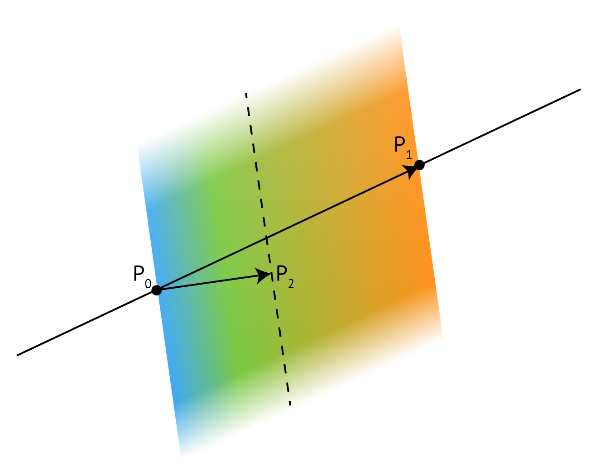
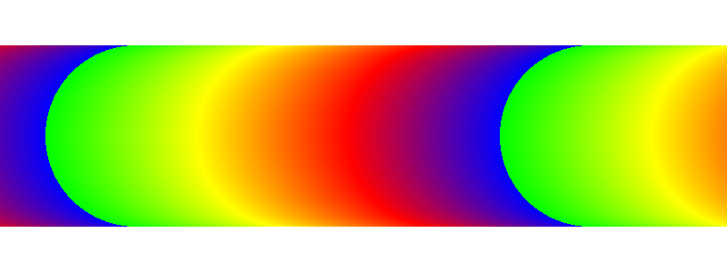

# Gradients for COLR/CPAL Fonts

December 2019

### Authors:
* Behdad Esfahbod ([@behdad](https://github.com/behdad))
* Dominik Röttsches ([@drott](https://github.com/drott))
* Roderick Sheeter ([@rsheeter](https://github.com/rsheeter))

## Table of Contents

- [Introduction](#introduction)
- [Backwards Compatibility](#backwards-compatibility)
- [Color Palette Variation](#color-palette-variation)
- [High-level Design](#high-level-design)
- [Graphical Primitives](#graphical-primitives)
  * [Color Line](#color-line)
    + [Extend Mode](#extend-mode)
      - [Extend Pad](#extend-pad)
      - [Extend Repeat](#extend-repeat)
      - [Extend Reflect](#extend-reflect)
  * [Linear Gradients](#linear-gradients)
  * [Radial Gradients](#radial-gradients)
- [Understanding the format](#understanding-the-format)
   - [Alpha](#alpha)
   - [Reusable Parts](#reusable-parts)
   - [Acyclic Graphs Only](#acyclic-graphs-only)
   - [Bounded Layers Only](#bounded-layers-only)
   - [Bounding Box](#bounding-box)
- [Structure of gradient COLR v1 extensions](#structure-of-gradient-colr-v1-extensions)
- [Implementation](#implementation)
  * [Font Tooling](#font-tooling)
  * [Rendering](#rendering)
    + [Pseudocode](#pseudocode)
    + [FreeType](#freetype)
    + [Chromium](#chromium)
  * [HarfBuzz](#harfbuzz)
- [Acknowledgements](#acknowledgements)


# Introduction

We’re proposing a format extension to the
[COLR](https://docs.microsoft.com/en-us/typography/opentype/spec/COLR) table to
allow gradient fills in addition to the existing solid color fills defined for
COLR. Current version number of COLR table is 0.  We propose this as COLR table
format version 1.  Older proposal and discussion [are
here](https://docs.google.com/document/d/1--J9CubVEIC1Pe9r7Nri6MNtZM0I92MjrYOCdJZteEI/edit).
This version addresses all issues raised with, and supersedes, the older
proposal.

It is our understanding that this brings the capabilities of COLR/CPAL to match
those of SVG Native for vector graphics.  SVG Native allows embedding PNG and
JPEG images while this proposal does not.  We like to explore in the future, how
COLR/CPAL can be mixed with sbix to address that limitation as well.

# Backwards Compatibility

The proposed design allows full backwards compatibility. This means, that a font
designed for COLR format v1 specification, can contain sufficient information to
be readable by a layout and rasterization engine that understands the v0 format.
This is possible because the format version of the COLR table is a short format,
as such considered a "minor", not a “major” version number.

If table format v1 is chosen, additional data will be read which specifies the
additional information for gradients.  All backward-compatibility concerns from
the earlier proposal are addressed in this version.

# Color Palette Variation

Allowing palette colors in
[CPAL](https://docs.microsoft.com/en-us/typography/opentype/spec/CPAL) to change
by variations is desired.  However, this needs more thought.  Colors expressed
in sRGB r/g/b channels *cannot* be easily interpolated.  Another solution is
needed, perhaps involving transforming to a linear color space and back.  To be
pursued separately.

# High-level Design

COLR table is extended to expose a new vector of layers per glyph.  If a glyph
is not found in the new vector, client will try finding it in the COLR v0 glyph
vector and fall back to no-color if the glyph is not found there either.

A glyph using the new extension is mapped to a list of layers. Each layer is
formed by a directed acyclic graph of paints. Several different types of paint
are defined:

1. **Solid** paints a solid color
1. **Linear gradient** paints a linear gradient
1. **Radial gradient** paints a radial gradient
1. **Transformed** reuses another paint, applying an affine transformation
1. **Composite** reuses two other paints, applying a compositing rule to combine them
   * We draw on https://www.w3.org/TR/compositing-1/ for our composite modes
1. **Glyph** draws a non-COLR glyph
   * A COLR v1 glyph made up of a list of Glyph paints is equivalent to a COLR v0 Layer Record with the added ability to use gradients.
1. **Colr Glyph** reuses a COLR v1 glyph at a new position in the graph

We have added an "alpha" (transparency) scalar to each invocation of a palette
color. This allows for the expression of translucent versions of palette
entries, as well as foreground, which we find useful.  Without this, various
translucent shades of the same color would need to be encoded separately in
the color palette, which is undesirable since color palette entries are designed
to be exposed to end-users.

All values expressed are *variable* by way of OpenType 1.8 Font Variations
mechanisms.

# Graphical Primitives

The two main graphical primitives that are added are linear gradients and radial
gradients.

In most graphics systems, linear gradients are declared using two points, and
radial gradients are declared using two circles.  Such graphics systems also
support a transformation matrix, via which one can get shear in linear
gradients, or arbitrary ellipses with radial gradients.  Since our proposed
format does *not* have such universal transform underneath, the definition of
linear and radial gradients are extended from their typical form to accommodate
for these transformations in the gradient declaration itself.

## Color Line

A color line is a function that maps real numbers to a color value to define a
1-dimensional gradient, to be used and referenced from [Linear
Gradients](#heading=h.696rgjwvuoq9) and [Radial
Gradients](#heading=h.2iel67nie7a). Colors of the gradient are defined by *color
stops*.

Color stops are defined at color stop positions. Color stop position 0 maps to
the start point of a linear gradient or the center of the first circle of a
radial gradient. Color stop position 1 maps to the end point of a linear
gradient or the center of the second circle of a radial gradient.  In the
interval [0, 1] the color line must contain at least one color stop, but may
contain multiple color stops that define the gradient.

Outside the defined interval, the gradient pattern in between the outer defined
positions is repeated according to the color line [extend
mode](#heading=h.4dwrambuyuzf).

If there are multiple color stops defined for the same coordinate, the first one
is used for computing the color value for values below the coordinate, the last
one is used for computing the color value for values above. All other color
stops for this coordinate are ignored.

Limiting the specified interval to a sub-range of [0, 1] allows for looping
through colors repeatedly along the mapped distance, without having to encode
them multiple times.  In that sense, our color line is similar to CSS
[repeating-linear-gradient()](https://developer.mozilla.org/en-US/docs/Web/CSS/repeating-linear-gradient)
and
[repeating-radial-gradient()](https://developer.mozilla.org/en-US/docs/Web/CSS/repeating-radial-gradient)
functions.

In order to achieve:

* one gradient along the gradient positions (linear, or radial) and padded
  colors outside this range, color stops at 0 and 1 must be defined, and color
  line extend mode *pad* must be used. This achieves similarly behavior as
  defined in CSS
  [linear-gradient()](https://developer.mozilla.org/en-US/docs/Web/CSS/linear-gradient)
  and
  [radial-gradient()](https://developer.mozilla.org/en-US/docs/Web/CSS/radial-gradient)
  functions.

* a repeated gradient along the gradient positions (linear or radial): divide 1
  by the number of desired repetitions and use the result as your maximum color
  stop, then use color line extend mode *repeat* to have it continue outside the
  defined interval.

* a mirrored / color-circle gradient: divide 1 by two times the number of
  desired full color stripes, and define the color stops between the 0 and the
  result of this division, then use color line extend mode *reflect* to have it
  continue mirrored.

 

***Figure 1:** Repeating linear and radial gradients
([source](https://cssnewbie.com/apply-cool-linear-and-radial-gradients-using-css/))*

### Extend Mode

We propose three extend modes to control the behavior of the gradient outside
its specified endpoints:

#### Extend Pad

For numbers outside the defined interval the color line continues to map to the
outer color values, i.e. for values less than the leftmost defined color stop,
it maps to the leftmost color stop value; for values greater than the rightmost
defined color stop value, it maps to the rightmost defined color value.

#### Extend Repeat

For numbers outside outside the interval, the color line continues to map as if
the defined interval was repeated.

#### Extend Reflect

For numbers outside the defined interval, the color continues to map as if the
interval would continue mirrored from the previous interval. This allows
defining stripes in rotating colors.

## Linear Gradients

We propose definitions of linear gradients with two color line points P0 and P1
between which a gradient is interpolated. A point P2 is defined to rotate the
gradient angle / orientation separately from the color line endpoints.

If the dot-product (P₁ - P₀) . (P₂ - P₀) is zero (or near-zero for an
implementation-defined definition) then gradient is ill-formed and nothing must
be rendered.



*__Figure 2:__ Linear gradient defining points*

## Radial Gradients

A radial gradient in this proposal is a gradient between two—optionally
transformed—circles, namely with center c0 and radius r0, and center c1 and
radius r1 and a specified color line.  The circle c0, r0 will be drawn with the
color at color line position 0. The circle c1, r1 will be drawn with the color
at color line colorLine position 1.

The optionally defined affine transformation matrix is used to transform the
circles into ellipses around their center.

The drawing algorithm radial gradients follows the [HTML WHATWG Canvas spec for
createRadialGradient()](https://html.spec.whatwg.org/multipage/canvas.html#dom-context-2d-createradialgradient).
Quoting and adapting from there.  With circle center points c0 and c1 defined as
c0 = (x0, y0) and c1 = (x1, y1):

Radial gradients must be rendered by following these steps:

1. If c0 = c1 and r0 = r1 then the radial gradient must paint nothing. Return.

2. Let x(ω) = (x1-x0)ω + x0
Let y(ω) = (y1-y0)ω + y0
Let r(ω) = (r1-r0)ω + r0  
Let the color at ω be the color at that position on the gradient color line (with the colors coming from the interpolation and extrapolation described above).

3. For all values of ω where r(ω) > 0, starting with the value of ω nearest to
   positive infinity and ending with the value of ω nearest to negative
   infinity, draw the circumference of the ellipse resulting from translating
   circle with radius r(ω) by affine transform at position (x(ω), y(ω)), with
   the color at ω, but only painting on the parts of the bitmap that have not
   yet been painted on by earlier circles in this step for this rendering of the
   gradient.



***Figure 3:** Example of a radial gradient rendering.*

**TODO:** Add illustration of center points, radii, etc. similar to the radial
one.

**Note:** The coordinates for the circle/ellipse centers are *not*
transformed by the affine matrix if present.  Implementations might need to
apply the inverse of the affine matrix to center coordinates before passing all
to underlying graphics systems like Skia or Cairo that apply their (often called
*user-*) transformation matrix to everything.

**Note:** Implementations must be careful to properly render radial gradient
even if the provided affine matrix is
*[degenerate](https://en.wikipedia.org/wiki/Invertible_matrix)* or
*near-degenerate*. Such radial gradients do have a well-defined shape, which is
a strip or a cone filled with a linear gradient.  Implementations using the
inverse-transform approach noted above can fall back to a linear-gradient
combined with a clipping path to achieve proper rendering of problematic affine
transforms.

# Understanding the format

## Alpha

The alpha channel for a layer can be populated using `PaintComposite`:

- `PaintSolid` can be used to set a blanket alpha
- `PaindLinearGradient` and `PaintRadialGradient` can be used to set gradient alpha
- Mode [Source In](https://www.w3.org/TR/compositing-1/#porterduffcompositingoperators_srcin) can be used to mask

## Reusable Parts

Use `PaintTransformed` to reuse parts in different positions or sizes.

Use `PaintColrGlyph` to reuse entire COLR glyphs.

For example, consider the Noto clock emoji (hand colored for emphasis):


The entire backdrop (outline, gradient-circle, 4 dots, the minute
hand) is reusable for all versions of the clock:


The hour hand is reusable as a transformed glyph.

Another example might be emoji faces: many have the same backdrop
with different eyes, noses, tears, etc drawn on top.

## Acyclic Graphs Only

`PaintColrGlyph` allows recursive composition of COLR glyphs. This
is desirable for reusable parts but introduces the possibility of
a cyclic graph. Implementations should track the COLR gids they have
seen in processing and fail if a gid is reached repeatedly.

## Bounded Layers Only

Every entry in the `LayerV1List` must define a bounded region.
Implementations must confirm this invariant. Unbounded layers must
not render.

The following paints are always bounded:

- `PaintGlyph`
- `PaintColrGlyph`

The following paints are always unbounded:

- `PaintSolid`
- `PaintLinearGradient`
- `PaintRadialGradient`

The following paints *may* be bounded:

- `PaintTransformed` is bounded IFF the source is bounded
- `PaintComposite` boundedness varies by mode:
   - Always bounded
      - `COMPOSITE_CLEAR`
   - Bounded IFF src is bounded
      - `COMPOSITE_SRC`
      - `COMPOSITE_SRC_OUT`
   - Bounded IFF backdrop is bounded
      - `COMPOSITE_DEST`
      - `COMPOSITE_DEST_OUT`
   - Bounded IFF src OR backdrop is bounded
      - `COMPOSITE_SRC_IN`
      - `COMPOSITE_DEST_IN`
   - Bounded IFF src AND backdrop are bounded
      - *all other modes*

## Bounding Box

The bounding box of the base (non-COLR) glyph referenced from the
`BaseGlyphV1Record` (by `BaseGlyphV1Record::gid`) should be taken
to describe the bounding box for the COLR v1 glyph.

Note: A `glyf` entry with two points at the diagonal extrema would suffice.

Note: This can be used to allocate a drawing surface without traversing
the COLR v1 glyph structure.

# Structure of gradient COLR v1 extensions

Offsets are always relative to the start of the containing struct.

```C++
// Base types

template <typename T, typename Length=uint16>
struct ArrayOf
{
  Length count;
  T      array[/*count*/];
};

typedef uint32 VarIdx;

template <typename T>
struct Variable
{
  T      value;
  VarIdx varIdx;
};

typedef Variable<Fixed> VarFixed;

typedef Variable<FWORD> VarFWORD;

typedef Variable<UFWORD> VarUFWORD;

Typedef Variable<F2DOT14> VarF2DOT14; // [-1.0, 1.0]

// Scale and/or rotate
struct Affine2x2
{
  VarFixed xx;
  VarFixed xy;
  VarFixed yx;
  VarFixed yy;
};

// Scale, rotate, translate
struct Affine2x3
{
  VarFixed xx;
  VarFixed xy;
  VarFixed yx;
  VarFixed yy;
  VarFixed dx;
  VarFixed dy;
};

// Building blocks

// The ColorIndex alpha is multiplied into the CPAL color looked up using
// paletteIndex to produce a final color
struct ColorIndex
{
  uint16     paletteIndex;
  VarF2DOT14 alpha; // Default 1.0. Values outside [0.,1.] reserved.
};

struct ColorStop
{
  VarF2DOT14 stopOffset;
  ColorIndex color;
};

enum Extend : uint8
{
  EXTEND_PAD     = 0,
  EXTEND_REPEAT  = 1,
  EXTEND_REFLECT = 2,
};

// Compositing modes are taken from https://www.w3.org/TR/compositing-1/
// NOTE: a brief audit of major implementations suggests most support most
// or all of the specified modes.
enum CompositeMode : uint8
{
  // Porter-Duff modes
  // https://www.w3.org/TR/compositing-1/#porterduffcompositingoperators
  COMPOSITE_CLEAR          =  0,  // https://www.w3.org/TR/compositing-1/#porterduffcompositingoperators_clear
  COMPOSITE_SRC            =  1,  // https://www.w3.org/TR/compositing-1/#porterduffcompositingoperators_src
  COMPOSITE_DEST           =  2,  // https://www.w3.org/TR/compositing-1/#porterduffcompositingoperators_dst
  COMPOSITE_SRC_OVER       =  3,  // https://www.w3.org/TR/compositing-1/#porterduffcompositingoperators_srcover
  COMPOSITE_DEST_OVER      =  4,  // https://www.w3.org/TR/compositing-1/#porterduffcompositingoperators_dstover
  COMPOSITE_SRC_IN         =  5,  // https://www.w3.org/TR/compositing-1/#porterduffcompositingoperators_srcin
  COMPOSITE_DEST_IN        =  6,  // https://www.w3.org/TR/compositing-1/#porterduffcompositingoperators_dstin
  COMPOSITE_SRC_OUT        =  7,  // https://www.w3.org/TR/compositing-1/#porterduffcompositingoperators_srcout
  COMPOSITE_DEST_OUT       =  8,  // https://www.w3.org/TR/compositing-1/#porterduffcompositingoperators_dstout
  COMPOSITE_SRC_ATOP       =  9,  // https://www.w3.org/TR/compositing-1/#porterduffcompositingoperators_srcatop
  COMPOSITE_DEST_ATOP      = 10,  // https://www.w3.org/TR/compositing-1/#porterduffcompositingoperators_dstatop
  COMPOSITE_XOR            = 11,  // https://www.w3.org/TR/compositing-1/#porterduffcompositingoperators_xor

  // Blend modes
  // https://www.w3.org/TR/compositing-1/#blending
  COMPOSITE_SCREEN         = 12,  // https://www.w3.org/TR/compositing-1/#blendingscreen
  COMPOSITE_OVERLAY        = 13,  // https://www.w3.org/TR/compositing-1/#blendingoverlay
  COMPOSITE_DARKEN         = 14,  // https://www.w3.org/TR/compositing-1/#blendingdarken
  COMPOSITE_LIGHTEN        = 15,  // https://www.w3.org/TR/compositing-1/#blendinglighten
  COMPOSITE_COLOR_DODGE    = 16,  // https://www.w3.org/TR/compositing-1/#blendingcolordodge
  COMPOSITE_COLOR_BURN     = 17,  // https://www.w3.org/TR/compositing-1/#blendingcolorburn
  COMPOSITE_HARD_LIGHT     = 18,  // https://www.w3.org/TR/compositing-1/#blendinghardlight
  COMPOSITE_SOFT_LIGHT     = 19,  // https://www.w3.org/TR/compositing-1/#blendingsoftlight
  COMPOSITE_DIFFERENCE     = 20,  // https://www.w3.org/TR/compositing-1/#blendingdifference
  COMPOSITE_EXCLUSION      = 21,  // https://www.w3.org/TR/compositing-1/#blendingexclusion
  COMPOSITE_MULTIPLY       = 22,  // https://www.w3.org/TR/compositing-1/#blendingmultiply

  // Modes that, uniquely, do not operate on components
  // https://www.w3.org/TR/compositing-1/#blendingnonseparable
  COMPOSITE_HSL_HUE        = 23,  // https://www.w3.org/TR/compositing-1/#blendinghue
  COMPOSITE_HSL_SATURATION = 24,  // https://www.w3.org/TR/compositing-1/#blendingsaturation
  COMPOSITE_HSL_COLOR      = 25,  // https://www.w3.org/TR/compositing-1/#blendingcolor
  COMPOSITE_HSL_LUMINOSITY = 26,  // https://www.w3.org/TR/compositing-1/#blendingluminosity
};

struct ColorLine
{
  Extend             extend;
  ArrayOf<ColorStop> stops;
};

// Layer DAG


struct PaintSolid
{
  uint8  format; // = 1
  Color  color;
};

struct PaintLinearGradient
{
  uint8               format; // = 2
  Offset32<ColorLine> colorLine;
  VarFWORD            x0;
  VarFWORD            y0;
  VarFWORD            x1;
  VarFWORD            y1;
  VarFWORD            x2; // Normal; Equal to (x1,y1) in simple cases.
  VarFWORD            y2;
};

struct PaintRadialGradient
{
  uint8               format; // = 3
  Offset32<ColorLine> colorLine;
  VarFWORD            x0;
  VarFWORD            y0;
  VarUFWORD           radius0;
  VarFWORD            x1;
  VarFWORD            y1;
  VarUFWORD           radius1;
  Offset32<Affine2x2> transform; // May be NULL.
};

struct PaintTransformed
{
  uint8               format; // = 4
  Offset16<Paint>     src;
  Affine2x3           transform;
};

struct PaintComposite
{
  uint8               format; // = 5
  CompositeMode       mode;   // If mode is unrecognized use 0 (Clear)
  Offset16<Paint>     src;
  Offset16<Paint>     backdrop;
};

// Paint a non-COLR glyph, filled as indicated by paint.
struct PaintGlyph
{
  uint8               format; // = 6
  uint16              gid;    // shall not be a COLR gid
  Offset16<Paint>     paint;
}

struct PaintColrGlyph
{
  uint8               format; // = 7
  uint16              gid;    // shall be a COLR gid
}

// Glyph root
// NOTE: uint8 size saves bytes in most cases and does not
// preclude use of large layer counts via PaintComposite.
typedef ArrayOf<Offset16<Paint>, uint8> LayerV1List;

// Each layer is OVER previous
struct BaseGlyphV1Record
{
  uint16                gid;
  Offset32<LayerV1List> layers;
};

typedef ArrayOf<BaseGlyphV1Record, uint32> BaseGlyphV1List;

struct COLRv1
{
  // Version-0 fields
  uint16                                            version;
  uint16                                            numBaseGlyphsV0;
  Offset32<SortedUnsizedArrayOf<BaseGlyphRecordV0>> baseGlyphsV0;
  Offset32<UnsizedArrayOf<LayerRecordV0>>           layersV0;
  uint16                                            numLayersV0;
  // Version-1 additions
  Offset32<BaseGlyphV1List>                         baseGlyphsV1;
  Offset32<ItemVariationStore>                      varStore;
};

```

# Implementation

## Font Tooling

Cosimo ([@anthrotype](https://github.com/anthrotype)) and Rod ([@rsheeter](https://github.com/rsheeter))
have implemented [nanoemoji](https://github.com/googlefonts/nanoemoji) to compile a set of SVGs into color
font formats, including COLR v1.

[color-fonts](https://github.com/googlefonts/color-fonts) has a collection of sample color fonts.

## Rendering

### Pseudocode

```
Allocate a bitmap for the glyph according to glyf table entry extents for gid
0) Traverse layers for gid, add current gid to blacklist *1
 a) Paint a paint, switch:
    1) PaintGlyph
         gid must not COLRv1
         saveLayer
         setClipPath to gid path
           recurse to a)
         restore
    2) PaintColorGlyph
         gid must be from
         if gid on recursion blacklist, do nothing
         recurse to 0) with different gid
    3) PaintComposite
          paint Paint for backdrop, call a)
          saveLayer() with setting composite mode, on SkPaint
          paint Paint for src, call a)
          restore with save composite mode
    4) PaintTransformed
          saveLayer()
          apply transform
          call a) for paint
          restore
    5) PaintRadialGradient
          SkCanvas::drawPaint with radial gradient configured
          (expected to be bounded by parent composite mode or clipped by current clip, check bounds?)
    6) PaintLinearGradient
          SkCanvas::drawPaint with liner gradient configured
          (expected to be bounded by parent composite mode or clipped by current clip, check bounds?)
    7) PaintSolid
          SkCanvas::drawColor with color configured

 *1 (in the implementation, potentially collapse each pair as PaintComposite (3) with first gid as backdrop, second as src, or just draw on root SkCanvas directly)
```

### FreeType

FreeType API extensions needed for a) rasterisation b ) as well as API exposing
all the details of the gradients so clients can *render* them as they wish, by
encoding as gradients in PDF output for example.

### Chromium

Prototype an implementation inside Skia's FreeType based COLR/CPAL
implementation extending solid color fills with gradient fills, after extracting
gradient fill implementation from FreeType. See
[`SkFonstHost_FreeType_common.cpp`](https://cs.chromium.org/chromium/src/third_party/skia/src/ports/SkFontHost_FreeType_common.cpp?q=fonthost+common&sq=package:chromium&dr=C&l=433)

## HarfBuzz

HarfBuzz implementation will follow later.  No major client relies on HarfBuzz
for color fonts currently, but we certainly want to implement later as there are
clients who like to remove FreeType dependency completely.

# Acknowledgements

Thanks to Benjamin Wagner ([@bungeman](https://github.com/bungeman)), Dave
Crossland ([@davelab6](https://github.com/davelab6)), and Roderick Sheeter
([@rsheeter](https://github.com/rsheeter)) for review and detailed feedback on
earlier proposal.
