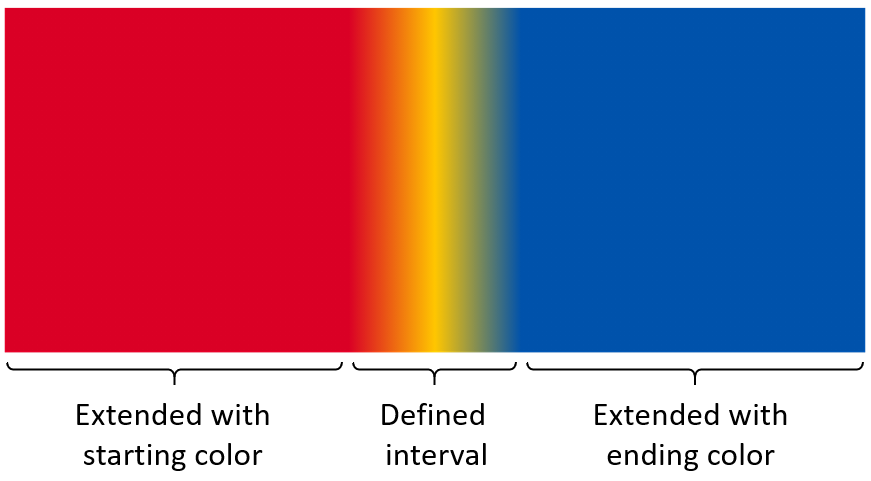

# Gradients for COLR/CPAL Fonts

December 2019

### Authors:
* Behdad Esfahbod ([@behdad](https://github.com/behdad))
* Dominik Röttsches ([@drott](https://github.com/drott))
* Roderick Sheeter ([@rsheeter](https://github.com/rsheeter))

## Table of Contents

- [Introduction](#introduction)
  - [High-level Design](#high-level-design)
  - [Backwards Compatibility](#backwards-compatibility)
- [Graphical Primitives / Paints](#graphical-primitives--paints)
  - [Filled Glyph](#filled-glyph)
  - [Solid Color and Gradient Paints](#solid-color-and-gradient-paints)
    - [Solid](#solid)
  - [COLR Glyph](#colr-glyph)
  - [COLR Layers](#colr-layers)
- [OFF Changes](#off-changes)
  - [COLR table](#off-5711-colr--color-table)
    - [Data structures](#colr-v1-data-structures)
      - [Header, glyphs, and layers](#header-glyphs-layers)
      - [Variation structures](#variation-structures)
      - [Color structures](#color-structures)
      - [Paint structures](#paint-structures)
      - [Composite modes](#composite-modes)
      - [Transform](#transform)
      - [Constraints](#constraints)
        - [Acyclic Graphs Only](#acyclic-graphs-only)
        - [Bounded Layers Only](#bounded-layers-only)
        - [Bounding Box](#bounding-box)
      - [Understanding COLR v1](#understanding-colr-v1)
        - [Alpha](#alpha)
- [Implementation](#implementation)
  - [Font Tooling](#font-tooling)
  - [Rendering](#rendering)
    - [Pseudocode](#pseudocode)
    - [FreeType](#freetype)
    - [Chromium](#chromium)
  - [HarfBuzz](#harfbuzz)
- [References](#references)
- [Acknowledgements](#acknowledgements)
- [Annex A: Proposed changes to ISO/IEC 14496-22](#annex-a-proposed-changes-to-isoiec-14496-22)
  - [A.1 Changes to OFF 4.3 Data types](#a1-changes-to-off-43-data-types)
  - [A.2 Changes to OFF 5.7.11 - Color Table](#a2-changes-to-off-5711---color-table)
  - [A.3 Changes to OFF 7.2.3 Item variation stores](#a3-changes-to-off-723-item-variation-stores)
  - [A.4 Changes to OFF Bibliography](#a4-changes-to-off-bibliography)

# Introduction

**The Introduction section is expected be converted into specific OFF section edits
later in the specification process**

We propose an extension of the COLR table to allow gradient fills in addition to
the existing solid color fills. The current version number of COLR table is 0.
We propose this as COLR table format version 1.

It is our understanding that this brings the capabilities of COLR/CPAL to match
those of SVG Native for vector graphics.  SVG Native allows embedding PNG and
JPEG images while this proposal does not.  We like to explore in the future, how
COLR/CPAL can be mixed with sbix to address that limitation as well.

## High-level Design

The COLR table is extended to expose a new vector of layers per glyph.  If a
glyph is not found in the new vector, the client will try finding it in the COLR
v0 glyph vector and fall back to no-color if the glyph is not found there
either.

A glyph using the new extension is mapped to a list of layers. Each layer in
this vector of layers is formed by a directed acyclic graph of paints. The glyph
rendering is defined by executing and combining the paint operations as
described by this graph.

*__Note:__ Each paint reflects typical operations found in
[2D graphics libraries](#2d-graphics-libraries).*

Several different types of paint are defined:

1. **[Glyph](#glyph)** fills the shape of a
   non-COLR glyph with subsequent paints
1. **[Solid color and gradient paints](#solid-color-and-gradient-paints)**
   1. **[Solid](#solid)** paints a solid color
   1. **[Linear gradient](#linear-gradient)** paints a linear gradient
   1. **[Radial gradient](#radial-gradient)** paints a radial gradient
1. **[Transformation](#transformation)** reuses another paint, applying an
   affine transformation
1. **[Composition](#composition)** reuses two other paints, applying a
   compositing rule to combine them
   * We draw on https://www.w3.org/TR/compositing-1/ for our composite modes
1. **[COLR Glyph](#colr-glyph)** reuses a COLR v1 glyph at a new position in the graph
1. **[COLR Layers](#colr-layers)** paint one or more layers

We have added an "alpha" (transparency) scalar to each invocation of a palette
color. This allows for the expression of translucent versions of palette
entries, as well as foreground, which we find useful.  Without this, various
translucent shades of the same color would need to be encoded separately in
the color palette, which is undesirable since color palette entries are designed
to be exposed to end-users.

All values expressed are *variable* by way of OFF Font Variations.

## Backwards Compatibility

The proposed design allows full backwards compatibility. This means, that a font
designed for COLR format v1 specification, can contain sufficient information to
be readable by a layout and rasterization engine that understands the v0 format.
This is possible because the format version of the COLR table is a short format,
as such considered a "minor", not a “major” version number.

If table format v1 is chosen, additional data will be read which specifies the
additional information for gradients.

# Graphical Primitives / Paints

## Glyph

A glyph paint `PaintGlyph` fills the region within the glyph shape
identified by `gid` with downstream paint operations specified by `paint`.

*__Note__: An implementation may chose to implement this as clipping the drawing
region to the shape specified by `gid`, then opening a temporary layer and
recurse to the subsequent paint opperations specified by `paint`, after which
the temporary layer is merged.*

## Solid Color and Gradient Paints

The main graphical primitives that are added in this proposal are linear and
radial gradients, transformations and compositions. Solid fills, which are also
defined, are similar to COLR v0. Gradients are defined by the help of [Color
Line](#color-line)s and color stops, explained in the sections further below.

### Solid

A solid paint fills the drawing region with a solid color specified by
`ColorIndex`. `ColorIndex` references color `paletteIndex` from the `CPAL`
palette, and applies alpha value `alpha` when drawing.

## COLR Glyph

`PaintColrGlyph` is a special paint which allows reuse of a COLR glyph of this
proposed exension as a paint. Painting a `PaintColrGlyph` means executing the
paint operations that are described by the `BaseGlyphV1Record` matching the
glyph id `gid` specified in `PaintColrGlyph`. See section [Reusable Parts](#reusable-parts).  

## COLR Layers

`PaintColrLayers` points to a sequence of Paint pointers and specifies how many
to consume. The mechanism can be used to share layers or sequences of layers
between multiple COLR glyphs.

*Example:* Suppose glyph
A has 10 layers, 3 of which are a common backdrop that glyph B also uses. Glyph B
can define a PaintColrLayers record that points to the same layers as A for the
common parts.

See section [Reusable Parts](#reusable-parts).

# OFF Changes

> NOTE: Content within the doc is in process of being reorganized. For clarity a new section for the proposed OFF changes is created at the end of the doc: [Annex A: Proposed changes to ISO/IEC 14496-22](#annex-a-proposed-changes-to-isoiec-14496-22)

## OFF 5.7.11 COLR – Color Table

The current header should be noted as *COLR version 0 header*.

A new section for *COLR version 1 header* should be added, along with a
set of related records and tables.

### COLR v1 data structures

This section describes new and modified tables and records for COLR v1.

Offsets are always relative to the start of the containing struct.

#### Header, glyphs, layers

##### V1 Header

| Type | Field name | Description |
|-|-|-|
| uint16 | version | Table version number—set to 1. |
| uint16 | numBaseGlyphRecords | May be 0 in a version 1 table. |
| Offset32 | baseGlyphRecordsOffset | Offset to baseGlyphRecords array (may be NULL). |
| Offset32 | layerRecordsOffset | Offset to layerRecords array (may be NULL). |
| uint16 | numLayerRecords | May be 0 in a version 1 table. |
| Offset32 | baseGlyphV1ListOffset | Offset to BaseGlyphV1List table. |
| Offset32 | layersV1Offset | Offset to LayerV1List table. |
| Offset32 | itemVariationStoreOffset | Offset to ItemVariationStore (may be NULL). |

##### BaseGlyphV1List table

| Type | Name | Description |
|-|-|-|
| uint32 | numBaseGlyphV1Records |  |
| BaseGlyphV1Record | baseGlyphV1Records[numBaseGlyphV1Records] | |

Entries shall be sorted in ascending order of the `glyphID` field of the `BaseGlyphV1Record`s.

*__Note:__ The sorted order allows implementations to perform binary search to
find a matching `BaseGlyphV1Record` for a specific `glyphID`.*

##### BaseGlyphV1Record

| Type | Name | Description |
|-|-|-|
| uint16 | glyphID | Glyph ID of the base glyph. |
| Offset32 | paintOffset | Offset to Paint, typically a `PaintColrLayers` |

*Note:* The glyph ID is not limited to the numGlyphs value in the &#39;maxp&#39; table.

##### LayerV1List table

| Type | Field name | Description |
|-|-|-|
| uint32 | numLayers |  |
| Offset32 | paintOffsets[numLayers] | Offsets to Paint tables. |

Only layers referenced by `PaintColrLayers` (format 1) records need to be
encoded here.

#### Variation structures

The following records are defined to facilitate COLR v1 font variation
support.

To indicate no variation, set varOuterIndex and varInnerIndex to 0xFFFF.

##### VarFWord record

| Type | Name | Description |
|-|-|-|
| FWORD | coordinate | |
| uint16 | varOuterIndex | |
| uint16 | varInnerIndex | |

##### VarUFWord record

| Type | Name | Description |
|-|-|-|
| UFWORD | distance | |
| uint16 | varOuterIndex | |
| uint16 | varInnerIndex | |

##### VarFixed record

| Type | Name | Description |
|-|-|-|
| Fixed | value | |
| uint16 | varOuterIndex | |
| uint16 | varInnerIndex | |

*Note:* In order to combine deltas with Fixed values, the ItemVariationStore format is
extended to allow for int32 deltas. When combining a Fixed value with 32-bit deltas,
the Fixed value is treated as though it were int32.

##### VarF2Dot14 record

| Type | Name | Description |
|-|-|-|
| F2Dot14 | value | |
| uint16 | varOuterIndex | |
| uint16 | varInnerIndex | |

Values are inherently limited to [-2., 2). In some contexts, limited to the [-1., 1.] or  [0., 1.].

*Note:* When combining an F2Dot14 with 16-bit deltas, the F2Dot14 is treated as though it were int16.

#### Color structures

##### Extend enumeration

| Value | Name | Description |
|-|-|-|
| 0 | EXTEND_PAD     | Use nearest color stop. |
| 1 | EXTEND_REPEAT  | Repeat from farthest color stop. |
| 2 | EXTEND_REFLECT | Mirror color line from nearest end. |

If a ColorLine.extend value is not recognized, use EXTEND_PAD.

##### ColorIndex record

| Type | Name | Description |
|-|-|-|
| uint16 | paletteIndex | Index for a CPAL palette entry. |
| VarF2Dot14 | alpha | Variable alpha value. |

Values for alpha outside [0.,1.] are reserved.

The ColorIndex alpha is multiplied into the alpha of the CPAL entry (converted to float -- divide by 255) to produce a final alpha.

##### ColorStop record

| Type | Name | Description |
|-|-|-|
| VarF2Dot14 | stopOffset | Proportional distance on a color line; variable. |
| ColorIndex | color | |

##### ColorLine table

| Type | Name | Description |
|-|-|-|
| uint8 | extend | An Extend enum value. |
| uint16 | numStops | Number of ColorStop records. |
| ColorStop | colorStops[numStops] | |

#### Paint structures

##### PaintColrLayers table (format 1)

| Type | Field name | Description |
|-|-|-|
| uint8 | format | Set to 1. |
| uint8 | numLayers | Number of offsets to Paint to read from layers. |
| uint32 | firstLayerIndex | Index into the LayerV1List. |

Each layer is composited on top of previous with mode COMPOSITE_SRC_OVER.

*Note:* uint8 size saves bytes in most cases. Large layer counts can be
achieved by way of PaintComposite or a tree of PaintColrLayers.


##### PaintSolid table (format 2)

| Type | Field name | Description |
|-|-|-|
| uint8 | format | Set to 2. |
| ColorIndex | color | Solid color fill. |

##### PaintLinearGradient table (format 3)

| Type | Field name | Description |
|-|-|-|
| uint8 | format | Set to 3. |
| Offset24 | colorLineOffset | Offset to ColorLine, from start of PaintLinearGradient table. |
| VarFWord | x0 | Start point x coordinate. |
| VarFWord | y0 | Start point y coordinate. |
| VarFWord | x1 | End point x coordinate. |
| VarFWord | y1 | End point y coordinate. |
| VarFWord | x2 | Rotation vector end point x coordinate. |
| VarFWord | y2 | Rotation vector end point y coordinate. |

For linear gradient without skew, set x2,y2 to x1,y1.

##### PaintRadialGradient table (format 4)

|Type | Field name | Description |
|-|-|-|
| uint8 | format | set to 4. |
| Offset24 | colorLineOffset | offset from start of PaintRadialGradient table |
| VarFWord | x0 | start circle center x coordinate |
| VarFWord | y0 | start circle center y coordinate |
| VarUFWord | radius0 | start circle radius |
| VarFWord | x1 | end circle center x coordinate |
| VarFWord | y1 | end circle center y coordinate |
| VarUFWord | radius1 | end circle radius |

##### PaintGlyph table (format 5)

| Type | Field name | Description |
|-|-|-|
| uint8 | format | Set to 5. |
| Offset24 | paintOffset | Offset to a Paint table, from start of PaintGlyph table. |
| uint16 | glyphID | Glyph ID for the source outline. |

Glyph outline is used as clip mask for the content in the Paint subtable. Glyph ID shall be less than the numGlyphs value in the &#39;maxp&#39; table.

##### PaintColrGlyph table (format 6)

| Type | Field name | Description |
|-|-|-|
| uint8 | format | Set to 6. |
| uint16 | glyphID | Virtual glyph ID for a BaseGlyphV1List base glyph. |

Glyph ID shall be in the BaseGlyphV1List; may be greater than maxp.numGlyphs.

*__Note:__ The PaintColrGlyph and PaintColrLayers tables are similar in that
they provide a way to reference a graph of paint tables as a sub-component
within a color glyph description. (The PaintColrGlyph does this indirectly via a
base glyph ID.) They may be handled differently in implementations, however. In
particular, an implementation can process and cache the result of the color
glyph description for a given base glyph ID. In that case, subsequent references
to that base glyph ID using a PaintColrGlyph table would not require the
corresponding graph of paint tables to be re-processed. As a result, using a
PaintColrGlyph for re-used graphic components could provide performance
benefits.*

##### PaintTransformed table (format 7)

| Type | Field name | Description |
|-|-|-|
| uint8 | format | Set to 7. |
| Offset24 | paintOffset | Offset to a Paint subtable, from start of PaintTransformed table. |
| Affine2x3 | transform | An Affine2x3 record (inline). |

#### PaintRotate table (format 8)

| Type | Field name | Description |
|-|-|-|
| uint8 | format | Set to 8. |
| Offset24 | paintOffset | Offset to a Paint subtable, from start of PaintRotate table. |
| VarFixed | angle | Rotation angle, in counter-clockwise degrees. |
| VarFixed | centerX | x coordinate for the center of rotation. |
| VarFixed | centerY | y coordinate for the center of rotation. |

*__Note:__ Rotation can also be represented using the PaintTransformed table. The important difference is in allowing an angle to be specified directly in degrees, which is more amenable to smooth variation.*

#### PaintSkew table (format 9)

| Type | Field name | Description |
|-|-|-|
| uint8 | format | Set to 9. |
| Offset24 | paintOffset | Offset to a Paint subtable, from start of PaintSkew table. |
| VarFixed | xSkewAngle | Angle of skew in the direction of the x-axis, in counter-clockwise degrees. |
| VarFixed | ySkewAngle | Angle of skew in the direction of the y-axis, in counter-clockwise degrees. |
| VarFixed | centerX | x coordinate for the center of skew. |
| VarFixed | centerY | y coordinate for the center of skew. |

*__Note:__ Skews can also be represented using the PaintTransformed table. The important difference is in being able to specify skew as an angle rather than as changes to basis vectors. Also, when varying angles, a representation directly in degrees is more amenable to smooth variation.*

##### PaintComposite table (format 10)

| Type | Field name | Description |
|-|-|-|
| uint8 | format | Set to 10. |
| Offset24 | sourcePaintOffset | Offset to a source Paint table, from start of PaintComposite table. |
| uint8 | compositeMode | A CompositeMode enumeration value. |
| Offset24 | backdropPaintOffset | Offset to a backdrop Paint table, from start of PaintComposite table. |

If compositeMode value is not recognized, COMPOSITE_CLEAR is used.

#### Composite modes

Supported composition modes are taken from the W3C [Compositing and Blending Level 1][1] specification.

##### CompositeMode enumeration

| Value | Name | Description |
|-|-|-|
| | *Porter-Duff modes* | |
| 0 | COMPOSITE_CLEAR | See [Clear][2] |
| 1 | COMPOSITE_SRC | See [Copy][3] |
| 2 | COMPOSITE_DEST | See [Destination][4] |
| 3 | COMPOSITE_SRC_OVER | See [Source Over][5] |
| 4 | COMPOSITE_DEST_OVER | See [Destination Over][6] |
| 5 | COMPOSITE_SRC_IN | See [Source In][7] |
| 6 | COMPOSITE_DEST_IN | See [Destination In][8] |
| 7 | COMPOSITE_SRC_OUT | See [Source Out][9] |
| 8 | COMPOSITE_DEST_OUT | See [Destination Out][10] |
| 9 | COMPOSITE_SRC_ATOP | See [Source Atop][11] |
| 10 | COMPOSITE_DEST_ATOP | See [Destination Atop][12] |
| 11 | COMPOSITE_XOR | See [XOR][13] |
| | *Separable color blend modes:* | |
| 12 | COMPOSITE_SCREEN | See [screen blend mode][14] |
| 13 | COMPOSITE_OVERLAY | See [overlay blend mode][15] |
| 14 | COMPOSITE_DARKEN | See [darken blend mode][16] |
| 15 | COMPOSITE_LIGHTEN | See [lighten blend mode][17] |
| 16 | COMPOSITE_COLOR_DODGE | See [color-dodge blend mode][18] |
| 17 | COMPOSITE_COLOR_BURN | See [color-burn blend mode][19] |
| 18 | COMPOSITE_HARD_LIGHT | See [hard-light blend mode][20] |
| 19 | COMPOSITE_SOFT_LIGHT | See [soft-light blend mode][21] |
| 20 | COMPOSITE_DIFFERENCE | See [difference blend mode][22] |
| 21 | COMPOSITE_EXCLUSION | See [exclusion blend mode][23] |
| 22 | COMPOSITE_MULTIPLY | See [multiply blend mode][24] |
| | *Non-separable color blend modes:* | |
| 23 | COMPOSITE_HSL_HUE | See [hue blend mode][25] |
| 24 | COMPOSITE_HSL_SATURATION | See [saturation blend mode][26] |
| 25 | COMPOSITE_HSL_COLOR | See [color blend mode][27] |
| 26 | COMPOSITE_HSL_LUMINOSITY | See [luminosity blend mode][28] |

#### Transform

##### Affine2x3 record

| Type | Name | Description |
|-|-|-|
| VarFixed | xx | x-component of transformed x-basis vector |
| VarFixed | yx | y-component of transformed x-basis vector |
| VarFixed | xy | x-component of transformed y-basis vector |
| VarFixed | yy | y-component of transformed y-basis vector |
| VarFixed | dx | Translation in x direction. |
| VarFixed | dy | Translation in y direction. |

The `Affine2x3` record is a 2x3 matrix for 2D affine transformations, so
that for a transformation matrix _M_ and an extended starting vector _v = (x, y, 1)_
the mapped vector _v′_ is calculated as _v′ = M * v_. That is:

_v′<sub>x</sub>_ = _xx * x + xy * y + dx_  
_v′<sub>y</sub>_ = _yx * x + yy * y + dy_

_Note:_ It is helpful to understand linear transformations by their effect
on *x-* and *y-basis* vectors _î = (1, 0)_ and _ĵ = (0, 1)_. The transform
described by the Affine2x3 record maps the basis vectors to _î′ = (xx, yx)_ 
and _ĵ′ = (xy, yy)_, and translates the origin to _(dx, dy)_.


#### Constraints

Constraints on the data structures making up a COLR version 1 should
be noted.

##### Acyclic Graphs Only

`PaintColrGlyph` and `PaintColrLayers` allow recursive composition of
COLR glyphs. This is desirable for reusable parts but introduces the
possibility of a cyclic graph. Implementations should fail if a cycle
is detected.

*Note:* Cycle detection can be achieved by keeping a set of addresses of visited paints.
Before processing a paint check if it's address is in the set, if it is we have a cycle
and should fail. Once done processing a given paint, including children, take it's address
out of the set. This allows the same paint to be reached repeatedly as long as no
cycle is formed. Pseudocode:

```
# called initially with the base glyph paint and an empty set
function paintIsAcyclic(paint, active_paints)
  if paint in active_paints
    fail: we have a cycle
  add paint to active_paints

  process paint, calling paintIsAcyclic() recursively for referenced paints

  remove paint from active_paints
```

##### Bounded Layers Only

The `BaseGlyphV1Record` paint must define a bounded region. That is,
is must paint within an area for which a finite bounding box could be
defined. Implementations must confirm this invariant.
A `BaseGlyphV1Record` with an unbounded paint must not render.

The following paints are always bounded:

- `PaintGlyph`
- `PaintColrGlyph`

The following paints are always unbounded:

- `PaintSolid`
- `PaintLinearGradient`
- `PaintRadialGradient`

The following paints *may* be bounded:

- `PaintTransformed` is bounded IFF the source is bounded
- `PaintComposite` boundedness varies by mode:
   - Always bounded
      - `COMPOSITE_CLEAR`
   - Bounded IFF src is bounded
      - `COMPOSITE_SRC`
      - `COMPOSITE_SRC_OUT`
   - Bounded IFF backdrop is bounded
      - `COMPOSITE_DEST`
      - `COMPOSITE_DEST_OUT`
   - Bounded IFF src OR backdrop is bounded
      - `COMPOSITE_SRC_IN`
      - `COMPOSITE_DEST_IN`
   - Bounded IFF src AND backdrop are bounded
      - *all other modes*
- `PaintColrLayers` is bounded IFF all referenced layers are bounded

##### Bounding Box

The bounding box of the base (non-COLR) glyph referenced from the
`BaseGlyphV1Record` (by `BaseGlyphV1Record::gid`) should be taken
to describe the bounding box for the COLR v1 glyph.

Note: A `glyf` entry with two points at the diagonal extrema would suffice.

Note: This can be used to allocate a drawing surface without traversing
the COLR v1 glyph structure.


#### Understanding COLR v1

Addition of explanatory content explaining how COLR version 1 functions
should be added.

##### Alpha

The alpha channel for a layer can be populated using `PaintComposite`:

- `PaintSolid` can be used to set a blanket alpha
- `PaindLinearGradient` and `PaintRadialGradient` can be used to set gradient alpha
- Mode [Source In](https://www.w3.org/TR/compositing-1/#porterduffcompositingoperators_srcin) can be used to mask


# Implementation

**This section is NOT meant for ISO submissions**

## C++ Structures

The following provides a C++ implementation of the structures defined above.

```C++
// Base template types

template <typename T, typename Length=uint16>
struct ArrayOf
{
  Length count;
  T      array[/*count*/];
};

typedef uint32 VarIdx;

template <typename T>
struct Variable
{
  T      value;
  VarIdx varIdx; // Use 0xFFFFFFFF to indicate no variation.
};

// Variation structures

typedef Variable<FWORD> VarFWORD;

typedef Variable<UFWORD> VarUFWORD;

typedef Variable<Fixed> VarFixed;

typedef Variable<F2DOT14> VarF2DOT14;

// Color structures

// The ColorIndex alpha is multiplied into the alpha of the CPAL entry
// (converted to float -- divide by 255) looked up using paletteIndex to
// produce a final alpha.
struct ColorIndex
{
  uint16     paletteIndex;
  VarF2DOT14 alpha; // Default 1.0. Values outside [0.,1.] reserved.
};

struct ColorStop
{
  VarF2DOT14 stopOffset;
  ColorIndex color;
};

enum Extend : uint8
{
  EXTEND_PAD     = 0,
  EXTEND_REPEAT  = 1,
  EXTEND_REFLECT = 2,
};

struct ColorLine
{
  Extend             extend;
  ArrayOf<ColorStop> stops;
};


// Composition modes

// Compositing modes are taken from https://www.w3.org/TR/compositing-1/
// NOTE: a brief audit of major implementations suggests most support most
// or all of the specified modes.
enum CompositeMode : uint8
{
  // Porter-Duff modes
  // https://www.w3.org/TR/compositing-1/#porterduffcompositingoperators
  COMPOSITE_CLEAR          =  0,  // https://www.w3.org/TR/compositing-1/#porterduffcompositingoperators_clear
  COMPOSITE_SRC            =  1,  // https://www.w3.org/TR/compositing-1/#porterduffcompositingoperators_src
  COMPOSITE_DEST           =  2,  // https://www.w3.org/TR/compositing-1/#porterduffcompositingoperators_dst
  COMPOSITE_SRC_OVER       =  3,  // https://www.w3.org/TR/compositing-1/#porterduffcompositingoperators_srcover
  COMPOSITE_DEST_OVER      =  4,  // https://www.w3.org/TR/compositing-1/#porterduffcompositingoperators_dstover
  COMPOSITE_SRC_IN         =  5,  // https://www.w3.org/TR/compositing-1/#porterduffcompositingoperators_srcin
  COMPOSITE_DEST_IN        =  6,  // https://www.w3.org/TR/compositing-1/#porterduffcompositingoperators_dstin
  COMPOSITE_SRC_OUT        =  7,  // https://www.w3.org/TR/compositing-1/#porterduffcompositingoperators_srcout
  COMPOSITE_DEST_OUT       =  8,  // https://www.w3.org/TR/compositing-1/#porterduffcompositingoperators_dstout
  COMPOSITE_SRC_ATOP       =  9,  // https://www.w3.org/TR/compositing-1/#porterduffcompositingoperators_srcatop
  COMPOSITE_DEST_ATOP      = 10,  // https://www.w3.org/TR/compositing-1/#porterduffcompositingoperators_dstatop
  COMPOSITE_XOR            = 11,  // https://www.w3.org/TR/compositing-1/#porterduffcompositingoperators_xor

  // Blend modes
  // https://www.w3.org/TR/compositing-1/#blending
  COMPOSITE_SCREEN         = 12,  // https://www.w3.org/TR/compositing-1/#blendingscreen
  COMPOSITE_OVERLAY        = 13,  // https://www.w3.org/TR/compositing-1/#blendingoverlay
  COMPOSITE_DARKEN         = 14,  // https://www.w3.org/TR/compositing-1/#blendingdarken
  COMPOSITE_LIGHTEN        = 15,  // https://www.w3.org/TR/compositing-1/#blendinglighten
  COMPOSITE_COLOR_DODGE    = 16,  // https://www.w3.org/TR/compositing-1/#blendingcolordodge
  COMPOSITE_COLOR_BURN     = 17,  // https://www.w3.org/TR/compositing-1/#blendingcolorburn
  COMPOSITE_HARD_LIGHT     = 18,  // https://www.w3.org/TR/compositing-1/#blendinghardlight
  COMPOSITE_SOFT_LIGHT     = 19,  // https://www.w3.org/TR/compositing-1/#blendingsoftlight
  COMPOSITE_DIFFERENCE     = 20,  // https://www.w3.org/TR/compositing-1/#blendingdifference
  COMPOSITE_EXCLUSION      = 21,  // https://www.w3.org/TR/compositing-1/#blendingexclusion
  COMPOSITE_MULTIPLY       = 22,  // https://www.w3.org/TR/compositing-1/#blendingmultiply

  // Modes that, uniquely, do not operate on components
  // https://www.w3.org/TR/compositing-1/#blendingnonseparable
  COMPOSITE_HSL_HUE        = 23,  // https://www.w3.org/TR/compositing-1/#blendinghue
  COMPOSITE_HSL_SATURATION = 24,  // https://www.w3.org/TR/compositing-1/#blendingsaturation
  COMPOSITE_HSL_COLOR      = 25,  // https://www.w3.org/TR/compositing-1/#blendingcolor
  COMPOSITE_HSL_LUMINOSITY = 26,  // https://www.w3.org/TR/compositing-1/#blendingluminosity
};

// Affine 2D transformations

// This is a standard 2x3 matrix for 2D affine transformation.
struct Affine2x3
{
  VarFixed xx;
  VarFixed yx;
  VarFixed xy;
  VarFixed yy;
  VarFixed dx;
  VarFixed dy;
};

// Paint tables

// Each layer is composited on top of previous with mode COMPOSITE_SRC_OVER.
// NOTE: uint8 size saves bytes in most cases and does not
// preclude use of large layer counts via PaintComposite or a tree
// of PaintColrLayers.
struct PaintColrLayers
{
  uint8               format; // = 1
  uint8               numLayers;
  uint32              firstLayerIndex;  // index into COLRv1::layersV1
}

struct PaintSolid
{
  uint8      format; // = 2
  ColorIndex color;
};

struct PaintLinearGradient
{
  uint8               format; // = 3
  Offset24<ColorLine> colorLine;
  VarFWORD            x0;
  VarFWORD            y0;
  VarFWORD            x1;
  VarFWORD            y1;
  VarFWORD            x2; // Normal; Equal to (x1,y1) in simple cases.
  VarFWORD            y2;
};

struct PaintRadialGradient
{
  uint8               format; // = 4
  Offset24<ColorLine> colorLine;
  VarFWORD            x0;
  VarFWORD            y0;
  VarUFWORD           radius0;
  VarFWORD            x1;
  VarFWORD            y1;
  VarUFWORD           radius1;
};

// Paint a non-COLR glyph, filled as indicated by paint.
struct PaintGlyph
{
  uint8               format; // = 5
  Offset24<Paint>     paint;
  uint16              gid;    // not a COLR-only gid
                              // shall be less than maxp.numGlyphs
}

struct PaintColrGlyph
{
  uint8               format; // = 6
  uint16              gid;    // shall be a COLR gid
}

struct PaintTransformed
{
  uint8               format; // = 7
  Offset24<Paint>     src;
  Affine2x3           transform;
};

struct PaintRotate
{
  uint8               format; // = 8
  Offset24<Paint>     src;
  VarFixed            angle
  VarFixed            centerX
  VarFixed            centerY
};

struct PaintSkew
{
  uint8               format; // = 9
  Offset24<Paint>     src;
  VarFixed            xSkewAngle
  VarFixed            ySkewAngle
  VarFixed            centerX
  VarFixed            centerY
};

struct PaintComposite
{
  uint8               format; // = 10
  Offset24<Paint>     src;
  CompositeMode       mode;   // If mode is unrecognized use COMPOSITE_CLEAR
  Offset24<Paint>     backdrop;
};

struct BaseGlyphV1Record
{
  uint16                gid;
  Offset32<Paint>       paint;  // Typically PaintColrLayers
};

// Entries shall be sorted in ascending order of the `glyphID` field of the `BaseGlyphV1Record`s.
typedef ArrayOf<BaseGlyphV1Record, uint32> BaseGlyphV1List;

// Only layers accessed via PaintColrLayers (format 1) need be encoded here.
typedef ArrayOf<Offset32<Paint>, uint32> LayerV1List;

struct COLRv1
{
  // Version-0 fields
  uint16                                            version;
  uint16                                            numBaseGlyphsV0;
  Offset32<SortedUnsizedArrayOf<BaseGlyphRecordV0>> baseGlyphsV0;
  Offset32<UnsizedArrayOf<LayerRecordV0>>           layersV0;
  uint16                                            numLayersV0;
  // Version-1 additions
  Offset32<BaseGlyphV1List>                         baseGlyphsV1;
  Offset32<LayerV1List>                             layersV1;
  Offset32<ItemVariationStore>                      varStore;
};

```

## Font Tooling

Cosimo ([@anthrotype](https://github.com/anthrotype)) and Rod ([@rsheeter](https://github.com/rsheeter))
have implemented [nanoemoji](https://github.com/googlefonts/nanoemoji) to compile a set of SVGs into color
font formats, including COLR v1.

[color-fonts](https://github.com/googlefonts/color-fonts) has a collection of sample color fonts.

## Rendering

### Pseudocode

```
Allocate a bitmap for the glyph according to glyf table entry extents for gid
0) Start at base glyph paint.
 a) Paint a paint, switch:
    1) PaintColrLayers
         Paint each referenced layer by performing a)
    2) PaintSolid
          SkCanvas::drawColor with color configured
    3) PaintLinearGradient
          SkCanvas::drawPaint with liner gradient configured
          (expected to be bounded by parent composite mode or clipped by current clip, check bounds?)
    4) PaintRadialGradient
          SkCanvas::drawPaint with radial gradient configured
          (expected to be bounded by parent composite mode or clipped by current clip, check bounds?)
    5) PaintGlyph
         gid must not COLRv1
         saveLayer
         setClipPath to gid path
           recurse to a)
         restore
    6) PaintColrGlyph
         gid must be from
         if gid on recursion blacklist, do nothing
         recurse to 0) with different gid
    7) PaintTransformed
          saveLayer()
          apply transform
          call a) for paint
          restore
    8) PaintRotate
          saveLayer()
          apply transform
          call a) for paint
          restore
    9) PaintSkew
          saveLayer()
          apply transform
          call a) for paint
          restore
    10) PaintComposite
          paint Paint for backdrop, call a)
          saveLayer() with setting composite mode, on SkPaint
          paint Paint for src, call a)
          restore with save composite mode
```

### FreeType

FreeType API extensions needed for a) rasterisation b ) as well as API exposing
all the details of the gradients so clients can *render* them as they wish, by
encoding as gradients in PDF output for example.

### Chromium

Prototype an implementation inside Skia's FreeType based COLR/CPAL
implementation extending solid color fills with gradient fills, after extracting
gradient fill implementation from FreeType. See
[`SkFonstHost_FreeType_common.cpp`](https://cs.chromium.org/chromium/src/third_party/skia/src/ports/SkFontHost_FreeType_common.cpp?q=fonthost+common&sq=package:chromium&dr=C&l=433)

## HarfBuzz

HarfBuzz implementation will follow later.  No major client relies on HarfBuzz
for color fonts currently, but we certainly want to implement later as there are
clients who like to remove FreeType dependency completely.

# References

* <a name="2d-graphics-libraries">2D Graphics Libraries</a>
   * [Cairo](https://cairographics.org/)
   * [Skia](https://skia.org/)
   * [CoreGraphics](https://developer.apple.com/documentation/coregraphics)
   * [Direct2D](https://docs.microsoft.com/en-us/windows/win32/direct2d/direct2d-portal)

# Acknowledgements

**This section is NOT meant for inclusion in ISO submissions**

Thanks to Benjamin Wagner ([@bungeman](https://github.com/bungeman)), Dave
Crossland ([@davelab6](https://github.com/davelab6)), and Roderick Sheeter
([@rsheeter](https://github.com/rsheeter)) for review and detailed feedback on
earlier proposal.

# Annex A: Proposed changes to ISO/IEC 14496-22

Changes to the following sections of ISO/IEC 14496-22:2019 Open Font Format (OFF) are proposed:

- 4.3 Data types
- 5.7.11 COLR – Color Table
- 7.2.3 Item variation stores
- Bibliography

## A.1 Changes to OFF 4.3 Data types

_Replace the table defining data types with the following (added row for Offset24):_

| Data Types | Description |
|-|-|
| uint8 | 8-bit unsigned integer. |
| int8 | 8-bit signed integer. |
| uint16 | 16-bit unsigned integer. |
| int16 | 16-bit signed integer. |
| uint24 | 24-bit unsigned integer. |
| uint32 | 32-bit unsigned integer. |
| int32 | 32-bit signed integer. |
| Fixed | 32-bit signed fixed-point number (16.16) |
| FWORD | int16 that describes a quantity in font design units. |
| UFWORD | uint16 that describes a quantity in font design units. |
| F2DOT14 | 16-bit signed fixed number with the low 14 bits of fraction (2.14). |
| LONGDATETIME | Date and time represented in number of seconds since 12:00 midnight, January 1, 1904. The value is represented as a signed 64-bit integer. |
| Tag | Array of four uint8s (length = 32 bits) used to identify a table, design-variation axis, script, language system, feature, or baseline |
| Offset16 | Short offset to a table, same as uint16, NULL offset = 0x0000 |
| Offset24 | 24-bit offset to a table, same as uint24, NULL offset = 0x000000 |
| Offset32 | Long offset to a table, same as uint32, NULL offset = 0x00000000 |

## A.2 Changes to OFF 5.7.11 - Color Table

_Replace the content of clause 5.7.11 with the following:_

The COLR table adds support for multi-colored glyphs in a manner that integrates with the rasterizers of existing text engines and that is designed to be easy to support with current OpenType font files.

The COLR table defines color presentations for glyphs. The color presentation of a glyph is specified as a graphic composition using other glyphs, such as a layered arrangement of glyphs, each with a different color. The term “color glyph” is used informally to refer to such a graphic composition defined in the COLR table; and the term “base glyph” is used to refer to a glyph for which a color glyph is provided. Processing of the COLR table is done on glyph sequences after text layout processing is completed and prior to final presentation of glyphs. Typically, a base glyph is a glyph that may occur in a sequence that results from the text layout process. In some cases, a base glyph may be a virtual glyph defined within this table as a re-usable color composition.

For example, the Unicode character U+1F600 is the grinning face emoji. Suppose in an emoji font the 'cmap' table maps U+1F600 to glyph ID 718. Assuming no glyph substitutions, glyph ID 718 would be considered the base glyph. Suppose the COLR table has data describing a color presentation for this using a layered arrangement of other glyphs with different colors assigned: that description and its presentation result would be considered the corresponding color glyph.

Two versions of the COLR table are defined.

Version 0 allows for a simple composition of colored elements: a linear sequence of glyphs that are stacked vertically as layers in bottom-up z-order. Each layer combines a glyph outline from the &#39;glyf&#39;, CFF or CFF2 table (referenced by glyph ID) with a solid color fill. These capabilities are sufficient to define color glyphs such as those illustrated in figure 5.6.


**Figure 5.6 Examples of the graphic capabilities of COLR version 0**

Version 1 supports additional graphic capabilities. In addition to solid colors, gradient fills can be used, as well as more complex fills using other graphic operations, including affine transformations and various blending modes. Version 1 capabilities allow for color glyphs such as those illustrated in figure 5.7:


**Figure 5.7 Examples of the graphic capabilities of COLR version 1**

Version 1 also extends capabilities in variable fonts. A COLR version 0 table can be used in variable fonts with glyph outlines being variable, but no other aspect of the color composition being variable. In version 1, all of the new constructs for which it could be relevant have been designed to be variable; for example, the placement of color stops in a gradient, or the alpha values applied to colors. The graphic capabilities supported in version 0 and in version 1 are described in more detail below.

The COLR table is used in combination with the CPAL table (5.7.12): all color values are specified as entries in color palettes defined in the CPAL table. If the COLR table is present in a font but no CPAL table exists, then the COLR table is ignored.

**5.7.11.1 Graphic Compositions**

The graphic compositions in a color glyph definition use a set of 2D graphic concepts and constructs:

* Shapes (or *geometries*)
* Fills (or *shadings*)
* Layering—a *z-order*—of elements
* Composition and blending modes—different ways that the content of a layer is combined with the content of layers above or below it
* Affine transformations

For both version 0 and version 1, shapes are obtained from glyph outlines in the &#39;glyf&#39;, &#39;CFF &#39; or CFF2 table, referenced by glyph ID. Colors used in fills are obtained from the CPAL table.

The simplest color glyphs use just a few of the concepts above: shapes, solid color fills, and layering. This is the set of capabilities provided by version 0 of the COLR table. In version 0, a base glyph record specifies the color glyph for a given base glyph as a sequence of layers. Each layer is specified in a layer record and has a shape (a glyph ID) and a solid color fill (a CPAL palette entry). The filled shapes in the layer stack are composed using only alpha blending.

Figure 5.8 illustrates the version 0 capabilities: three shapes are in a layered stack: a blue square in the bottom layer, an opaque green circle in the next layer, and a red triangle with some transparency in the top layer.


**Figure 5.8 Basic graphic capabilities of COLR version 0**

The basic concepts also apply to color glyphs defined using the version 1 formats: shapes are arranged in layers and have fills. But the additional formats of version 1 support much richer capabilities. In a version 1 color glyph, graphic constructs and capabilities are represented primarily in *Paint* tables, which are linked together in a *directed, acyclic graph*. Several different Paint formats are defined, each describing a particular type of graphic operation:

* A PaintColrLayers table provides a layering structure used for creating a color glyph from layered elements. A PaintColrLayers table can be used at the root of the graph, providing a base layering structure for the entire color glyph definition. A PaintColrLayers table can also be nested within the graph, providing a set of layers to define some graphic sub-component within the color glyph.

* The PaintSolid, PaintLinearGradient, and PaintRadialGradient tables provide basic fills, using color entries from the CPAL table.

* The PaintGlyph table provides glyph outlines as the basic shapes.

* The PaintTransformed table is used to apply an affine transformation matrix to a sub-graph of paint tables, and the graphic operations they represent. The PaintRotate and PaintSkew tables support specific transformations specified as angles.

* The PaintComposite table supports alternate compositing and blending modes for two sub-graphs.

* The PaintColrGlyph table allows a color glyph definition, referenced by a base glyph ID, to be re-used as a sub-graph within multiple color glyphs.

In a simple color glyph description, a PaintGlyph table might be linked to a PaintSolid table, for example, representing a glyph outline filled using a basic solid color fill. But the PaintGlyph table could instead be linked to a much more complex sub-graph of Paint tables, representing a shape that gets filled using the more-complex set of operations described by the sub-graph of Paint tables.

The graphic capabilities are described in more detail in 5.7.11.1.1 – 5.7.11.1.7. The formats used for each are specified 5.7.11.2.

**5.7.11.1.1 Colors and solid color fills**

All colors are specified as a base zero index into CPAL (5.7.12) palette entries. A font can define alternate palettes in its CPAL table; it is up to the application to determine which palette is used. A palette entry index value of 0xFFFF is a special case indicating that the text foreground color (defined by the application) should be used, and shall not be treated as an actual index into the CPAL ColorRecord array.

The CPAL color data includes alpha information, as well as RGB values. In the COLR version 0 formats, a color reference is made in LayerRecord as a palette entry index alone. In the formats added for COLR version 1, a color reference is made in a ColorIndex record, which includes a palette entry index and a separate alpha value. Separation of alpha from palette entries in version 1 allows use of transparency in a color glyph definition independent of the choice of palette. The alpha value in the ColorIndex record is multiplied into the alpha value given in the CPAL color entry.

In version 1, a solid color fill is specified using a PaintSolid table. See 5.7.11.1.3 for details on how a PaintSolid fill is applied to a shape.

**5.7.11.1.2 Gradients**

COLR version 1 supports two types of gradients: linear gradients, and radial gradients. Both types of gradient are defined using a color line.

**5.7.11.1.2.1 Color Lines**

A color line is a function that maps real numbers to color values to define a
one-dimensional gradation of colors, to be used in the definition of linear or
radial gradients. A color line is defined as a set of one or more color stops,
each of which maps a particular real number to a specific color.

On its own, a color line has no positioning, orientation or size within a design
grid. The definition of a linear or radial gradient will reference a color line
and map it onto the design grid by specifying positions in the design grid that
correspond to the real values 0 and 1 in the color line. The specification for
linear and radial gradients also include rules for where to draw interpolated
colors of the color line, following from the placement of 0 and 1.

A color stop is defined by a real number, the *stop offset*, and a color. A
color line is defined with at least one color stop within the interval [0, 1].
Additional color stops can be specified within or outside the interval [0, 1].
(Stop offsets are represented using F2DOT14 values, therefore color stops can
only be specified within the range [-2, 2). See <span
style="color:red">5.7.11.2.x</span> for format details.) If only one color stop
is specified, that color is used for the entire color line; at least two color
stops are needed to create color gradation.

Color gradation is defined over the interval from the first color stop, through
the successive color stops, to the last color stop. Between adjacent color
stops, color values are linearly interpolated.

> **_TBD: Does interpolation of colors need further specification?_**

If there are multiple color stops defined for the same stop offset, the first
one is used for computing color values on the color line below that stop offset,
and the last one is used for computing color values at or above that stop
offset. All other color stops for that stop offset are ignored.

While the color gradation is specified over a defined interval, the color line
continues indefinitely outside that interval in both directions. The color
pattern outside the defined interval is repeated according to the color line’s
*extend mode*. Three extend modes are supported:

* **Pad:** outside the defined interval, the color of the closest color stop is
used. Using a sequence of letters as an analogy, given a sequence “ABC”, it is
extended to “…*AA* ABC *CC*…”.

* **Repeat:** The color line is repeated over repeated multiples of the defined
interval. For example, if color stops are specified for defined interval of [0,
0.7], then the pattern is repeated above the defined interval for intervals
[0.7, 1.4], [1.4, 2.1], etc.; and also repeated below the defined interval for
intervals [-0.7, 0], [-1.4, -0.7], etc. In each repeated interval, the first
color is that of the farthest defined color stop. By analogy, given a sequence
“ABC”, it is extended to “…*ABC* ABC *ABC*…”.

* **Reflect:** The color line is repeated over repeated intervals, as for the repeat
mode. However, in each repeated interval, the ordering of color stops is the
reverse of the adjacent interval. By analogy, given a sequence “ABC”, it is
extended to “…*ABC CBA* ABC *CBA ABC*…”.

Figures 5.9 – 5.11 illustrate the different color line extend modes. The figures
show the color line extended over a limited interval, but the extension is
unbounded in either direction.



**Figure 5.9 Color gradation extended using pad mode**


**Figure 5.10 Color gradation extended using repeat mode**


**Figure 5.11 Color gradation extended using reflect mode**

NOTE: The extend modes are the same as the [spreadMethod][30] attribute used for
linear and radial gradients in the [Scalable Vector Graphics (SVG) 1.1 (Second
Edition)][31] specification.

When combining a color line with the geometry of a particular gradient
definition, one might want to achieve a certain number of repetitions of the
gradient pattern over a particular geometric range. Assuming that geometric
range will correspond to placement of stop offsets 0 and 1, the following steps
can be used:

* In order to get a certain number of repetitions of the gradient pattern
(without reflection), divide 1 by the number of desired repetitions, use the
result as the maximum stop offset for specified color stops, and set the extend
mode to *repeat*.
* In order to get a certain number of repetitions of the
reflected gradient pattern, divide 1 by two times the number of desired
repetitions, use the result as the maximum stop offset for specified color
stops, and set the extend mode to *reflect*.

**5.7.11.1.2.2 Linear gradients**

A linear gradient provide gradation of colors along a straight line. The gradient is defined by two points, p₀ and p₁, plus a color line, with stop offset 0 aligned to p₀ and stop offset 1.0 aligned to p₁. Colors between p₀ and p₁ are interpolated using the color line.

An additional point, p₂, is also used to rotate the gradient orientation in the space on either side of the line defined by p₀ and p₁. The vector from p₀ to p₂ can be referred to as the *rotation vector*. If the rotation vector is colinear with the line p₀p₁, there is no rotation: colors in the space on either side of the line p₀p₁ extend in the perpendicular direction. But if the rotation vector is not colinear, the gradient is drawn skewed by the angle between p₀p₁ and p₀p₂.

If the dot-product (p₁ - p₀) · (p₂ - p₀) is zero (or near-zero for an implementation-defined definition) then the gradient is ill-formed and shall not be rendered.

Figure 5.12 illustrates linear gradients using the three different color line extend modes and with two different rotation vectors. In each case, three color stops are specified: red at 0.0, yellow at 0.5, and red at 1.0.


**Figure 5.12 Linear gradients using pad, repeat, and reflect extend modes, and with different rotation vectors.**

**5.7.11.1.2.3 Radial gradients**

A radial gradient provides gradation of colors along a cylinder defined by two circles. The gradient is defined by circles with center c₀ and radius r₀, and with center c₁ and radius r₁, plus a color line. The color line aligns with the two circles by associating stop offset 0 with the first circle (with center c₀) and aligning stop offset 1.0 with the second circle (with center c₁). 

NOTE: The term “radial gradient” is used in some contexts for more limited capabilities. In some contexts, the type of gradient defined here is referred to as a “two point conical” gradient.

The drawing algorithm for radial gradients follows the [HTML WHATWG Canvas specification for
createRadialGradient()][32], but adapted with with alternate color line extend modes, as
described in 5.7.11.1.2.1. Radial gradients shall be rendered with results that match the
results produced by the following steps.

With circle center points c₀ and c₁ defined as c₀ = (x₀, y₀) and c₁ = (x₁, y₁):

1. If c₀ = c₁ and r₀ = r₁ then paint nothing and return.
2. For real values of ω:<br>
   Let x(ω) = (x₁-x₀)ω + x₀<br>
   Let y(ω) = (y₁-y₀)ω + y₀<br>
   Let r(ω) = (r₁-r₀)ω + r₀<br>
   Let the color at ω be the color at position ω on the color line.
3. For all values of ω where r(ω) > 0, starting with the value of ω nearest to
   positive infinity and ending with the value of ω nearest to negative
   infinity, draw the circumference of the ellipse resulting from translating
   a circle with radius r(ω) centered at position (x(ω), y(ω)), with
   the color at ω, but only painting on the parts of the bitmap that have not
   yet been painted on by earlier circles in this step for this rendering of the
   gradient.

The algorithm provides results in various cases as follows:

* When both radii are 0 (r₀ = r₁ = 0), then r(ω) is always 0 and nothing is painted.
* If the centers of the circles are distinct, the radii of the circles are different, and neither circle is entirely contained within the radius of the other circle, then the resulting shape resembles a cone that is open to one side. The surface outside the cone is not painted. (See figure 5.13.)
* If the centers of the circles are distinct but the radii are the same, and neither circle is contained within the other, then the result will be a strip, similar to the flattened projection of a circular cylinder. The surface outside the strip is not painted. (See figure 5.14.)
* If the radii of the circles are different but one circle is entirely contained within the radius of the other circle, the gradient will radiate in all directions from the inner circle, and the entire surface will be painted. (See figure 5.16.)

> **_TBD: What should the expected behaviour be in the case of both circles exactly overlapping with r > 0? (Only the extensions get painted, but how?)_**

Figure 5.13 illustrates a radial gradient using the three different color line extend modes. The color line is defined with stops for the interval [0, 1]: red at 0.0, yellow at 0.5, and blue at 1.0. Note that the circles that define the gradient are not stroked as part of the gradient itself. Stroked circles have been overlaid in the figure to illustrate the color line and the region that is painted in relation to the two circles.


**Figure 5.13 Radial gradients using pad, repeat, and reflect extend modes.**

Figure 5.14 illustrates the case in which the circles have distinct centers but the same radii, and neither circle is contained within the other, giving the appearance of a strip. The color stops and extend modes are as in figure 5.13.


**Figure 5.14 Radial gradients with same-sized circles appearing as a strip.**

Because the rendering algorithm progresses ω in a particular direction, from
positive infinity to negative infinity, and because pixels are not re-painted as
ω progresses, the appearance will be affected by which circle is considered
circle 0 and which is circle 1. 

This is illustrated in figure 5.15, in which three radial gradients are shown.
The first is the same as the first gradient shown in figure 5.13, using the pad
extend mode. In this first gradient, circle 0 is the small circle, on the left. In
the second gradient of figure 5.15, the start and end circles are reversed: circle
0 is the large circle, on the right. The color line is kept the same, and so the
red end starts at circle 0, now on the right. In the third gradient, the order
of stops in the color line is also reversed to put red on the left.
The key difference to notice between the gradients in figure 5.15 is the way colors
are painted in the interior: when the two circles are not overlapping, the arcs
of constant color bend in the same direction as the near side of circle 1.

NOTE: This difference does not exist if one circle is entirely contained within
the other: in that case, the arcs of constant color are complete circles.


**Figure 5.15 For cone- or strip-shaped radial gradients, arcs of constant color bend like the near side of circle 1.**

When one circle is contained within the other, the extension of the gradient beyond the larger circle will fill the entire surface. Colors in the areas inside the inner circle and outside the outer circle are determined by the extend mode. Figure 5.16 illustrates this for the different extend modes.


**Figure 5.16 Radial gradients with one circle contained within the other.**

NOTE: A scale transformation (see 5.7.11.1.5) can flatten shapes to resemble lines. If a radial gradient is nested in the child sub-graph of a transformation that flattens the circles so that they are nearly lines, the centers may still be separated by some distance. In that case, a radial gradient would appear as a strip or a cone filled with a linear gradient.

> **_TBD: We still need to specify required behaviour for the case in which the transform really flattens the two circles, and the centers, to a line._**

**5.7.11.1.3 Filling shapes**

All basic shapes used in a color glyph are obtained from glyph outlines, referenced using a glyph ID. In a color glyph description, a PaintGlyph table is used to represent a basic shape. 

NOTE: Shapes can also be derived using PaintGlyph tables in combination with other tables, such as PaintTransformed (see 5.7.11.1.5) or PaintComposite (see 5.7.11.1.6).

The PaintGlyph table has a field for the glyph ID, plus an offset to a child paint table that is used as the fill for the shape. The glyph outline is not rendered; only the fill is rendered.

Any of the basic fill formats, PaintSolid, PaintLinearGradient, or PaintRadialGradient, can be used as the child paint table. This is illustrated in figure 5.16: a PaintGlyph table has a glyph ID for an outline in the shape of a triangle, and it links to a child PaintLinearGradient table. The combination is used to represent a triangle filled with the linear gradient.


**Figure 5.16 PaintGlyph and PaintLinearGradient tables used to fill a shape with a linear gradient.**

Another way to describe the relationship between a PaintGlyph table and its child paint table is that the child provides a fill, and the glyph outline defines a bounds, or *clip region*, for the fill. The child for a PaintGlyph table is not limited to only the basic fill formats. In general, the child can be the root of a sub-graph that describes some graphic composition that comprises the fill for the shape. Or, in the alternate view, the glyph outline defines a clip region that is applied to the composition.

To illustrate this, the example in figure 5.16 is extended in figure 5.17 so that a PaintGlyph table links to a second PaintGlyph that links to a PaintLinearGradient: the parent PaintGlyph will clip the filled shape described by the child sub-graph.


**Figure 5.17 A PaintGlyph table defines a clip region for the composition defined by its child sub-graph.**

A PaintGlyph table on its own does not add content: if there is no child paint table, then the PaintGlyph table represents no presentation content and shall be ignored.

**5.7.11.1.4 Layers**

**5.7.11.1.5 Transformations**

A PaintTransform table can be used within a color glyph description to apply an
affine transformation matrix. Transformations supported by a matrix can be a
combination of scale, skew, mirror, rotate, or translate. The transformation is
applied to all nested paints in the child sub-graph.

The effect of a PaintTransform table is illustrated in figure 5.21: a PaintTransform is used to specify a rotation, and both the glyph outline and gradient in the sub-graph are rotated.


**Figure 5.21 A rotation transformation rotates the fill content defined by the child sub-graph.**

If another PaintTransform table occurs within the child sub-graph of the first PaintTransform table, then the other PaintTransform also applies to its child sub-graph. For the sub-sub-graph, the two transformations are combined. To illustrate this, the example in figure 5.21 is extended in figure 5.22 by inserting a mirroring transformation between the PaintGlyph and PaintLinearGradient tables: the glyph outline is rotated as before, but the gradient is mirrored in its (pre-rotation) y-axis as well as being rotated. Notice that both visible elements—the shape and the gradient fill—are affected by the rotation, but only the gradient is affected by the mirroring.


**Figure 5.22 Combined effects of a transformation nested within the child sub-graph of another transformation.**

The affine transformation is specified in a PaintTransform table as matrix elements. See <span style="color:red">5.7.11.2.x</span> for format details.

Whereas the PaintTransformed table supports several types of transforms, the PaintRotate and PaintSkew tables support specific transformations: rotation and skew. The significant difference of these paint formats is that rotations and skews are specified as angles, in counter-clockwise degrees.

NOTE: Specifying the rotation or skew as an angle can have a signficant benefit in variable fonts if an angle of skew or rotation needs to vary, since it is easier to implement variation of angles when specified directly rather than as matrix elements. This is because the matrix elements for a rotation or skew are the sine, cosine or tangent of the rotation angle, which do not change in linear proportion to the angle. To achieve a linear variation of rotation using matrix elements would require approximating the variation using multiple delta sets.

**5.7.11.1.6 Compositing and blending**

When a color glyph has overlapping content in two layers, the pixels in the two layers must be combined in some way. If the content in the top layer has full opacity, then normally the pixels from that layer are shown, occluding overlapping pixels from lower layers. If the top layer has some transparency (some portion has alpha less than 1.0), then blending of colors for overlapping pixels occurs by default. The default interaction between layers uses simple alpha compositing, as described in [Compositing and Blending Level 1][1].

A PaintComposite table can be used to get other compositing or blending effects. The
PaintComposite table combines content defined by two sub-graphs: a *source* sub-graph;
and a destination, or *backdrop*, sub-graph. First, the paint operations
for the backdrop sub-graph are executed, then the drawing operations for the source sub-graph are executed
and combined with backdrop using a specified compositing or blending mode.
The available modes are given in the CompositionModes enumeration (see 5.7.11.2.x). The effect and processing rule of each mode are specified in [Compositing and Blending Level 1][1].

The available modes fall into two general types: compositing modes, also referred to as “Porter-Duff” modes; and blending modes. In rough terms, the Porter-Duff modes determine how much effect pixels from the source and the backdrop each contribute in the result, while blending modes determine how color values for pixels from the source and backdrop are combined. These are illustrated with examples in figures 5.23 and 5.24: in each case, red and blue rectangles are the source and backdrop content.

Figure 5.23 shows the effect of a Porter-Duff mode, “XOR”, which has the effect that only non-overlapping pixels contribute to the result.


**Figure 5.23 Two content elements combined using the Porter-Duff XOR mode.**

Figure 5.24 shows the effect of a “lighten” blending mode, which has the effect that the R, G, and B color components for each pixel in the result is the greater of the R, G, and B values from corresponding pixels in the source and backdrop.


**Figure 5.24 Two content elements combined using the lighten blending mode.**

For complete details on each of the Porter-Duff and blending modes, see the [Compositing and Blending Level 1][1] specification.

Figure 5.25 illustrates how the PaintComposite table is used in combination with content sub-graphs to implement an alternate compositing effect. The source sub-graph defines a green capital A; the backdrop sub-graph defines a black circle. The compositing mode used is “source out”, which has the effect that the source content punches out a hole in the backdrop. (For this mode, the fill color of the source is irrelevant; a black or yellow "A" would have the same effect.) A red rectangle is included as a lower layer to show that the backdrop has been punched out by the source, making that portion of the lower layer visible.


**Figure 5.25 A color glyph using a PaintComposite table to punch out a shape from the fill of a circle.**

**5.7.11.1.7 Re-usable components**

Within a color font, many color glyphs might share components in common. For example, in emoji fonts, many different “smilies” or clock faces share a common background. This can be seen in figure 5.26, which shows color glyphs for three emoji clock faces.


**Figure 5.26 Emoji clock faces for 12 o’clock, 1 o’clock and 2 o’clock.**

Several components are shared between these color glyphs: the entire face, with a gradient background and dots at the 3, 6, 9 and 12 positions; the minute hand pointing to the 12 position; and the circles in the center. Also, note that the four dots have the same shape and fill, and differ only in their position. In addition, the hour hands have the same shape and fill, and differ only in their orientation.

There are several ways in which elements of a color glyph description can be re-used:

* Reference to shared subtables
* Use of a PaintColrLayers table
* Use of a PaintColrGlyph table

**5.7.11.1.7.1 Re-use by referencing shared subtables**

**5.7.11.1.7.2 Re-use using PaintColrLayers**

**5.7.11.1.7.3 Re-use using PaintColrGlyph**


**5.7.11.2 COLR table formats**

> **_[under construction—more to come]_**


## A.3 Changes to OFF 7.2.3 Item variation stores

_Delete the fourth paragraph, "Variation data is comprised..."._

_Add a new sub-clause 7.2.3.1 after the third paragraph ("The item variation store formats..."), with text as follows:_

**7.2.3.1 Associating target items to variation data**

Variation data is comprised of delta adjustment values that apply to particular target items. Some mechanism is needed to associate delta values with target items. In the item variation store, a block of delta values has an implicit delta-set index, and separate data outside the item variation store is provided that indicates the delta-set index associated with a given target item. Depending on the parent table in which an item variation store is used, different means are used to provide these associations:

* In the MVAR table, an array of records identifies target data items in various other tables, along with the delta-set index for each respective item.
* In the HVAR and VVAR tables, the target data items are glyph metric arrays in the &#39;hmtx&#39; and &#39;vmtx&#39; tables. Subtables in the HVAR and VVAR tables provide the mapping between the target data items and delta-set indices.
* For the BASE, GDEF, GPOS, and JSTF tables, a target data item is associated with a delta-set index using a related VariationIndex table (see 6.2.8) within the same subtable that contains the target item.
* In the COLR table, target data items are specified in structures that combine a basic data type, such FWORD, with a delta-set index.

The structures used in the COLR table currently are used only in that table but may be used in other tables in future versions, and so are defined here as common formats. Structures are defined to wrap the FWORD, UFWORD, F2DOT14 and Fixed basic types.

Note: as described below, each delta-set index is represented as two index components, an *outer* index and an *inner* index, corresponding to a two-level organizational hierarchy. This is described in detail below.

#### VarFWord

The FWORD type is used to represent coordinates in the glyph design grid. The VarFWord record is used to represent a coordinate that can be variable.

| Type | Name | Description |
|-|-|-|
| FWORD | coordinate | |
| uint16 | varOuterIndex | |
| uint16 | varInnerIndex | |

#### VarUFWord

The UFWord type is used to represent distances in the glyph design grid. The VarUFWord record is used to represent a distance that can be variable.

| Type | Name | Description |
|-|-|-|
| UFWORD | distance | |
| uint16 | varOuterIndex | |
| uint16 | varInnerIndex | |

#### VarF2Dot14

The F2DOT14 type is typically used to represent values that are inherently limited to a range of [-1, 1], or a range of [0, 1]. The VarF2Dot14 record is used to represent such a value that can be variable.

| Type | Name | Description |
|-|-|-|
| F2Dot14 | value | |
| uint16 | varOuterIndex | |
| uint16 | varInnerIndex | |

In general, variation deltas are (logically) signed 16-bit integers, and in most cases, they are applied to signed 16-bit values (FWORDs) or unsigned 16-bit values (UFWORDs). When scaled deltas are applied to F2DOT14 values, the F2DOT14 value is treated like a 16-bit integer. (In this sense, the delta and the F2DOT14 value can be viewed as integer values in units of 1/16384ths.)

If the context in which the VarF2Dot14 is used contrains the valid range for the default value, then any variations by applying deltas are clipped to that range.

#### VarFixed

The Fixed type is intended for floating values, such as variation-space coordinates. The VarFixed record is used to represent such a value that can be variable.

| Type | Name | Description |
|-|-|-|
| Fixed | value | |
| uint16 | varOuterIndex | |
| uint16 | varInnerIndex | |

While in most cases deltas are applied to 16-bit types, Fixed is a 32-bit (16.16) type and requires 32-bit deltas. The DeltaSet record used in the ItemVariationData subtable format can accommodate deltas that are, logically, either 16-bit or 32-bit. See the description of the [ItemVariationData subtable](#itemvariationdata-subtable), below, for details.

When scaled deltas are applied to Fixed values, the Fixed value is treated like a 32-bit integer. (In this sense, the delta and the Fixed value can be viewed as integer values in units of 1/65536ths.)

_Insert a sub-clause heading, "7.2.3.2 Variation data", after the newly-inserted text above, and before the paragraph beginning, "The ItemVariationStore table includes a variation region list..." Re-number subsequent sub-clauses accordingly._

_In the fifth paragraph that follows the figure in (now) 7.2.3.2, delete the first sentence, "A complete delta set index... within that subtable." Before that pragraph, insert the following paragraph:_

A complete delta-set index involves an outer-level index into the ItemVariationData subtable array, plus an inner-level index to a delta-set row within that subtable. A special meaning is assigned to a delta-set index 0xFFFF/0xFFFF (that is, outer-level and inner-level portions are both 0xFFFF): this is used to indicate that there is no variation data for a given item. Functionally, this would be equivalent to referencing delta-set data consisting of only deltas of 0 for all regions.

_In 7.2.3.3 (previously, 7.2.3.1), "Variation regions", in the table for the VariationRegionList structure, add the following sentence to the end of the description for the regionCount field._

Shall be less than 32,736.

_After the table for the VariationRegionList structure, add the following paragraph:_

The high-order bit of the regionCount field is reserved for future use, and shall be cleared.

_In 7.2.3.4 (previously 7.2.3.2), "Item variation store and item variation data tables", in the paragraph that follows the table for the ItemVariationStore structure, delete the first sentence, "The item variation store includes an array of offsets to item variation data subtables. Before that paragraph, insert the following paragraph and note:_

The item variation store includes an offset to a variation region list and an array of offsets to item variation data subtables.

NOTE: Indices into the itemVariationDataOffsets array are stored in parent tables as delta-set “outer” indices with each such index having a corresponding “inner” index. If the outer index points to a NULL offset, then any inner index will be invalid. The itemVariationDataOffsets array should not include any NULL offsets.

_In 7.2.3.4, in the table for the ItemVariationData subtable structure, replace the field name "shortDeltaCount" with "wordDeltaCount", and replace the description of that field with the following:"_

A packed field: the high bit is a flag—see details below.

_Following the table for the ItemVariationData subtable structure, replace the remainder of 7.2.3.4 (including the table for the DeltaSet record structure) with the following:_

The wordDeltaCount field contains a packed value that includes a flag and a “word” delta count. The format of this value is as follows:

| Mask | Name | Description |
|-|-|-|
| 0x8000 | LONG_WORDS | Flag indicating that “word” deltas are long (int32) |
| 0x7FFF | WORD_DELTA_COUNT_MASK | Count of “word” deltas |

The representation of delta values uses a mix of long types (“words”) and short types. If the LONG_WORDS flag is set, deltas are represented using a mix of int32 and int16 values. This representation is only used for deltas that are to be applied to data items of Fixed or 32-bit integer types. If the flag is not set, deltas are presented using a mix of int16 and int8 values. See the description of the DeltaSet record below for additional details.

The count value indicated by WORD_DELTA_COUNT_MASK is a count of the number of deltas that use the long (“word”) representation, and shall be less than or equal to regionIndexCount.

The deltaSets array represents a logical two-dimensional table of delta values with itemCount rows and regionIndexCount columns. Rows in the table provide sets of deltas for particular target items, and columns correspond to regions of the variation space. Each DeltaSet record in the array represents one row of the delta-value table — one delta set.

*DeltaSet record:*

<table>
<tbody>

<tr>
<th>Type</th>
<th>Name</th>
<th>Description</th>
</tr>

<tr>
<td>int16 and int8<br><em>or</em><br>int32 and int16</td>
<td>deltaData&#x200B;[regionIndexCount]</td>
<td>Variation delta values.</td>
</tr>

</tbody>
</table>

Logically, each DeltaSet record has regionIndexCount number of elements. The elements are represented using long and short types, as described above. These are either int16 and int8, or int32 and int16, according to whether the LONG_WORDS flag was set. The delta array has a sequence of deltas using the long type followed by sequence of deltas using the short type. The count of deltas using the long type is derived using WORD_DELTA_COUNT_MASK. The remaining elements use the short type. The length of the data for each row, in bytes, is regionIndexCount + (wordDeltaCount && WORD_DELTA_COUNT_MASK) if the LONG_WORDS flag is not set, or 2 x that amount if the flag is set.

NOTE: Delta values are each represented directly. They are not packed as in the tuple variation store.

## A.4 Changes to OFF Bibliography

_Add two new entries as follows:_

- HTML Living Standard, 4.12.5, The canvas element. https://html.spec.whatwg.org/multipage/canvas.html#the-canvas-element

- Compositing and Blending Level 1. W3C Candidate Recommendation, 13 January 2015. https://www.w3.org/TR/compositing-1/


[1]: https://www.w3.org/TR/compositing-1/
[2]: https://www.w3.org/TR/compositing-1/#porterduffcompositingoperators_clear
[3]: https://www.w3.org/TR/compositing-1/#porterduffcompositingoperators_src
[4]: https://www.w3.org/TR/compositing-1/#porterduffcompositingoperators_dst
[5]: https://www.w3.org/TR/compositing-1/#porterduffcompositingoperators_srcover
[6]: https://www.w3.org/TR/compositing-1/#porterduffcompositingoperators_dstover
[7]: https://www.w3.org/TR/compositing-1/#porterduffcompositingoperators_srcin
[8]: https://www.w3.org/TR/compositing-1/#porterduffcompositingoperators_dstin
[9]: https://www.w3.org/TR/compositing-1/#porterduffcompositingoperators_srcout
[10]: https://www.w3.org/TR/compositing-1/#porterduffcompositingoperators_dstout
[11]: https://www.w3.org/TR/compositing-1/#porterduffcompositingoperators_srcatop
[12]: https://www.w3.org/TR/compositing-1/#porterduffcompositingoperators_dstatop
[13]: https://www.w3.org/TR/compositing-1/#porterduffcompositingoperators_xor
[14]: https://www.w3.org/TR/compositing-1/#blendingscreen
[15]: https://www.w3.org/TR/compositing-1/#blendingoverlay
[16]: https://www.w3.org/TR/compositing-1/#blendingdarken
[17]: https://www.w3.org/TR/compositing-1/#blendinglighten
[18]: https://www.w3.org/TR/compositing-1/#blendingcolordodge
[19]: https://www.w3.org/TR/compositing-1/#blendingcolorburn
[20]: https://www.w3.org/TR/compositing-1/#blendinghardlight
[21]: https://www.w3.org/TR/compositing-1/#blendingsoftlight
[22]: https://www.w3.org/TR/compositing-1/#blendingdifference
[23]: https://www.w3.org/TR/compositing-1/#blendingexclusion
[24]: https://www.w3.org/TR/compositing-1/#blendingmultiply
[25]: https://www.w3.org/TR/compositing-1/#blendinghue
[26]: https://www.w3.org/TR/compositing-1/#blendingsaturation
[27]: https://www.w3.org/TR/compositing-1/#blendingcolor
[28]: https://www.w3.org/TR/compositing-1/#blendingluminosity
[29]: https://www.w3.org/TR/compositing-1/#blendingnormal
[30]: https://www.w3.org/TR/2011/REC-SVG11-20110816/pservers.html#LinearGradientElementSpreadMethodAttribute
[31]: https://www.w3.org/TR/SVG11/
